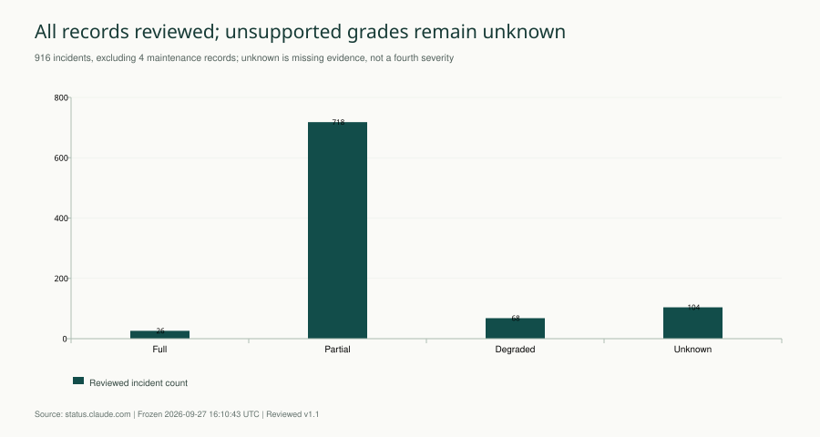
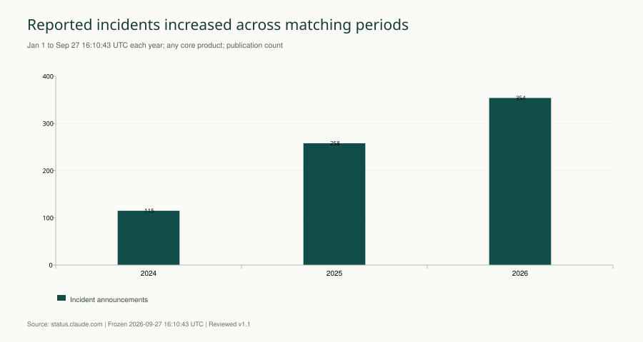
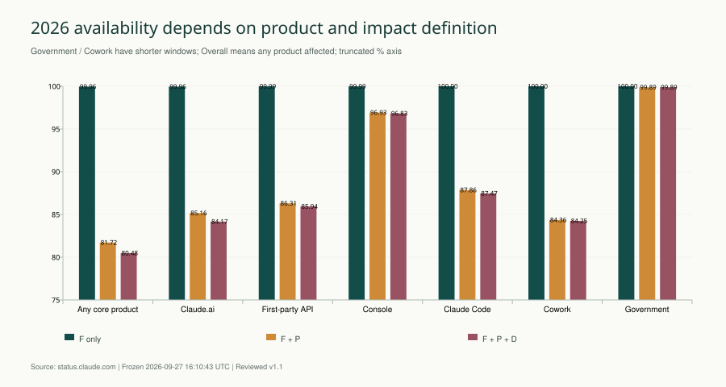
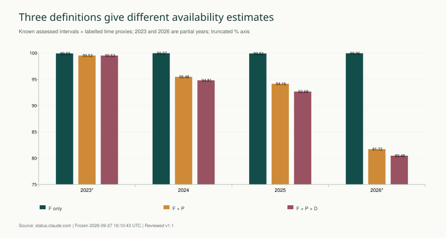
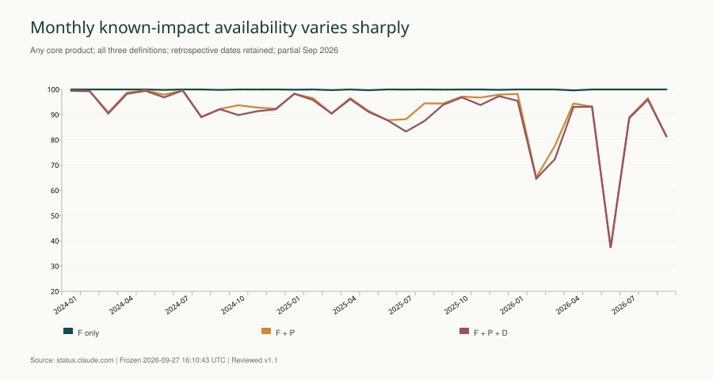
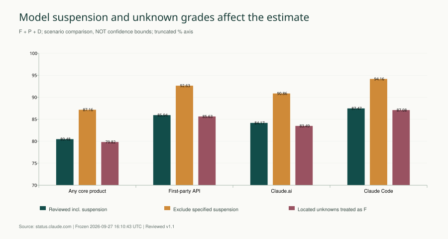

# Claude 可用性与事故复核报告

**Anthropic · v1.1 完成全量记录复核 · 冻结截止 2026-09-27 16:10:43 UTC**

来源：[Claude 官方状态站](https://status.claude.com)、[History](https://status.claude.com/history)。本版沿用 v1.0 的冻结原始证据，完成全部公告更新的语义审阅，重建分析区间并绘制六组图表。

> 920 条记录均已完成复核，其中 916 起事故、4 条维护。复核后的未知仍保留：104 起事故等级证据不足，168 起没有可纳入主序列的分析时间段（两者重叠）。以下数字是公开记录的时间可用性估计，包含明确标记的状态/公告代理；不是请求成功率或官方 SLA。

## 一、2026 年已知影响估计随故障定义而变化

核心服务并集的 **F 口径为 99.9593%，F∪P 为 81.7185%，F∪P∪D 为 80.4777%**。对应完整中断、再加入局部不可用、再加入性能与质量退化；Overall 指任一纳入产品发生相应影响。

第一方 API 的三种口径分别为 **99.9921% / 86.3055% / 85.9376%**。这是 API 产品及其功能的时间指标，不是模型调用成功率，不能按用户或请求量解释。

指定模型的主动访问暂停是重要长事件。将这条记录排除并重新合并重叠区间后，核心服务并集的 F∪P∪D 估计变为 **87.1621%**，相比主序列变化 **6.68 个百分点**。两种口径一并展示，不将安全性主动暂停悄悄剔除。

## 二、等级按产品范围定义，官方标签不能直接替代

| 等级 | 判定条件 | 常见边界 |
| --- | --- | --- |
| F 完整不可用 | 明确整个命名产品无法访问或提供核心服务 | 单模型全失败不等于整个 API 全失败 |
| P 局部不可用 | 特定用户、模型、请求、地区、功能或路径失败 | 登录、上传、连接器、限量模型故障 |
| D 性能/质量退化 | 延迟、输出质量、展示或数据完整性变差 | 质量下降不等于请求完全失败 |
| unknown 未知 | 读取全文后仍不足以确认上述类别 | 不是正常状态，也不是第四个等级 |

只写“错误率升高”、没有可判定范围或比例的公告保留未知；明确命名模型或功能受影响时按产品子范围判 P。整条事故的最高等级仅用于检索，时间计算使用逐产品、逐阶段等级。官方严重度和完整更新继续保留在 CSV 中。

[完整事故等级与时间定义](事故等级定义.md) 给出判定标准、未知处理、代理边界和根因定义。

图 1：完成复核后，等级证据不足的事故仍保留未知。可下载 [PNG](figures/06_reviewed_grades.png)、[SVG](figures/06_reviewed_grades.svg)、[图表数据](figures/06_reviewed_grades.csv)。

## 三、公开历史有 916 起事故，近年公告数量增加

| 公告年份 UTC | 事故 | 维护 |
| --- | --- | --- |
| 2023 | 30 | 0 |
| 2024 | 188 | 3 |
| 2025 | 334 | 1 |
| 2026 | 364 | 0 |

共 2,919 条更新。最早公告为 2023-03-14，最新公告为 2026-09-22。2026 年未完结，不能直接用 364 起与前一完整年度比较。

图 2：相同起止月日比较核心服务事故公告数；不同年份服务构成仍有变化。可下载 [PNG](figures/01_same_period_counts.png)、[SVG](figures/01_same_period_counts.svg)、[图表数据](figures/01_same_period_counts.csv)。

History 以三个月为一页，共保存 16 页，末页为早于页面创建日的空季度。920 个 History ID 与 920 个详情对象完全匹配，覆盖状态为 **enumerated**。这是公开可访问 History 的枚举，不证明未公开或删除的事故不存在。列表 API 第二页重复第一页，未用该接口的伪分页证明完整性。

采集证据见 [原始快照](../v1.0/snapshot.json)、[History 枚举轨迹](../v1.0/history-index.json)、[v1.0 原始 HTTP 证据目录说明](../v1.0/README.md)。交叉检查为 History 内嵌数据与详情 ID 对照，未声称浏览器逐页视觉核验。

## 四、观察窗口与重叠去重决定分母和分子

| 服务 | 观察开始 UTC | 观察结束 UTC |
| --- | --- | --- |
| 核心服务并集 | 2023-07-11T00:00:00Z | 2026-09-27T16:10:43Z |
| Claude.ai | 2023-07-11T00:00:00Z | 2026-09-27T16:10:43Z |
| 第一方 API | 2023-07-11T00:00:00Z | 2026-09-27T16:10:43Z |
| Console | 2023-07-11T00:00:00Z | 2026-09-27T16:10:43Z |
| Claude Code | 2025-05-23T00:00:00Z | 2026-09-27T16:10:43Z |
| Cowork | 2026-04-02T00:00:00Z | 2026-09-27T16:10:43Z |
| Government | 2026-02-18T00:00:00Z | 2026-09-27T16:10:43Z |

Claude.ai、API 和 Console 采用官方组件 start_date；较新服务采用组件创建后的首个完整 UTC 日，避免向组件出现之前回填“零故障”。这些日期是研究观察窗口，不能理解为产品上线日期。Overall 中每个产品仅在自身窗口内贡献区间；第三方 Vertex/Bedrock 与官网/文档/社交账号分别归 External/Other，排除核心服务。

**A = 1 − 对应等级影响时间的并集秒数 ÷ 观察窗口秒数。** 同事故阶段、产品之间、不同事故之间均去重；跨年分摊；维护排除。F、F∪P、F∪P∪D 分别重新计算，不能将事故小时或产品小时相加。

时间证据顺序为实际影响窗口、历史组件状态区间、有依据的公告活动周期代理。Monitoring 不自动当恢复；晚发复盘不延长影响；重开拆成多个阶段。日期或时区矛盾且无法消解时不编造精确时间。未知等级与无可定位阶段仍保留，**未进入分子的时间不等于已确认正常**。表中 100% 只表示没有可计量的对应等级区间，不表示证实全年零故障。

年度及月度 `incident_count` 按该产品首次已知分析影响时间归属，时间未知则按公告时间；另保留 `publication_count` 对照 History。两种数量不能混用。

## 五、2026 年产品可用性与对应影响小时数

图 3：2026 年产品时间可用性估计，纵轴截短以显示差异。可下载 [PNG](figures/03_product_availability.png)、[SVG](figures/03_product_availability.svg)、[图表数据](figures/03_product_availability.csv)。

| 服务 | 观察天数 | F 可用性 | F∪P 可用性 | F∪P∪D 可用性 | 全部等级小时 |
| --- | --- | --- | --- | --- | --- |
| 核心服务并集 | 269.67 | 99.9593% | 81.7185% | 80.4777% | 1,263.52 |
| Claude.ai | 269.67 | 99.9593% | 85.1638% | 84.1661% | 1,024.80 |
| 第一方 API | 269.67 | 99.9921% | 86.3055% | 85.9376% | 910.15 |
| Console | 269.67 | 99.9873% | 96.9275% | 96.8257% | 205.44 |
| Claude Code | 269.67 | 100.0000% | 87.8639% | 87.4652% | 811.28 |
| Cowork | 178.67 | 100.0000% | 84.3615% | 84.2532% | 675.25 |
| Government | 221.67 | 100.0000% | 99.8857% | 99.8857% | 6.08 |

| 服务 | F 小时 | F∪P 小时 | F∪P∪D 小时 | 未知等级公告数 | 无主分析区间公告数 |
| --- | --- | --- | --- | --- | --- |
| 核心服务并集 | 2.64 | 1,183.21 | 1,263.52 | 47 | 58 |
| Claude.ai | 2.64 | 960.22 | 1,024.80 | 44 | 50 |
| 第一方 API | 0.51 | 886.33 | 910.15 | 25 | 31 |
| Console | 0.82 | 198.86 | 205.44 | 16 | 16 |
| Claude Code | 0.00 | 785.47 | 811.28 | 28 | 33 |
| Cowork | 0.00 | 670.61 | 675.25 | 16 | 17 |
| Government | 0.00 | 6.08 | 6.08 | 2 | 3 |

Cowork 和 Government 的观察天数更短。更少的已披露事故或更短的观察历史不能单独证明更可靠。所有图表均附源数据，可在 [年度结果](annual-results.csv) 中复算。

## 六、年度和月度趋势反映已披露影响，而非请求成功率

图 4：年度三种等级口径；2023 和 2026 为不完整年度。可下载 [PNG](figures/02_annual_availability.png)、[SVG](figures/02_annual_availability.svg)、[图表数据](figures/02_annual_availability.csv)。

图 5：月度估计使用同一逐阶段口径；2026 年 9 月仅至冻结时间。可下载 [PNG](figures/05_monthly_availability.png)、[SVG](figures/05_monthly_availability.svg)、[图表数据](figures/05_monthly_availability.csv)。

| 年份 | 核心服务观察天数 | F | F∪P | F∪P∪D | 主序列影响小时 |
| --- | --- | --- | --- | --- | --- |
| 2023 | 174.00 | 99.9301% | 99.5335% | 99.5268% | 19.76 |
| 2024 | 366.00 | 99.9685% | 95.4789% | 94.8079% | 456.07 |
| 2025 | 365.00 | 99.9232% | 94.1591% | 92.6795% | 641.27 |
| 2026 | 269.67 | 99.9593% | 81.7185% | 80.4777% | 1,263.52 |

新增产品、披露粒度、未知事故比例和观察期长度都可能改变趋势。不能据此推导某项发布导致可靠性下降，也不能直接与本仓库 OpenAI 报告排名。同期比较见 [matched-window-results.csv](matched-window-results.csv)，月度细表见 [monthly-results.csv](monthly-results.csv)。

## 七、模型暂停和未知等级的敏感性需要并列呈现

图 6：敏感性场景重新合并区间，差异不是简单相减事故时长。可下载 [PNG](figures/04_sensitivity.png)、[SVG](figures/04_sensitivity.svg)、[图表数据](figures/04_sensitivity.csv)。

| 2026 核心并集场景 | F | F∪P | F∪P∪D | 含义 |
| --- | --- | --- | --- | --- |
| 主序列 | 99.9593% | 81.7185% | 80.4777% | 复核等级+标记代理 |
| 排除指定模型暂停 | 99.9593% | 88.4028% | 87.1621% | 排除单条主动暂停，重算并集 |
| 仅明确实际时间 | 99.9799% | 98.9921% | 98.1526% | 仅用于衡量时间证据覆盖，不能当真实上界 |
| 可定位未知等级均当 F | 99.0698% | 81.0621% | 79.8238% | 保守压力场景，不能当真实下界 |

暂停事件为 [We’ve suspended access to Claude Mythos 5 and Claude Fable 5](https://status.claude.com/incidents/s9w82lp9dcn9)，仅指定模型，产品范围为 P。相关官方说明见 [访问暂停说明](https://www.anthropic.com/news/fable-mythos-access) 与 [恢复说明](https://www.anthropic.com/news/redeploying-fable-5)。

“可定位未知均当 F”只改变存在候选时间的未知等级事故；完全无法定位的事件仍无法量化。因此这些场景**不是上下界或置信区间**。间歇错误的公告覆盖时间也不等于连续失败时长。例如 skills 功能间歇错误公告的代理区间约 159.60 小时；单独排除标记为间歇影响包络的三条记录后，2026 核心服务全部等级估计为 **82.8239%**（仍包含模型暂停）。此场景用于展示连续包络假设的影响，不能证明这些时段正常。详见 [全部敏感性数据](sensitivity-2026.csv)。公开披露样本不是随机抽样，没有依据给出统计误差条；这里报告的是口径敏感性。

## 八、全量复核已完成，证据缺口仍明确保留

| 复核和证据项目 | 结果 |
| --- | --- |
| 已完成逐记录语义复核 | 920 / 920；待复核 0；不代表厂商全部真实故障已知 |
| 事故等级分布 | partial_outage: 718；full_outage: 26；unknown: 104；degraded_performance: 68 |
| 无可纳入主序列时间段 | 168 / 916；含未知等级、无定位时间、明确无用户影响等 |
| 完整实际影响时间线 | 126 / 916；其余可能仅部分精确或代理 |
| 阶段时间来源 | explicit_impact: 150；announcement_proxy: 249；official_component_interval: 2277；timezone_inferred: 9 |
| 根因审阅 | not_disclosed: 884；vendor_stated: 32 |
| 明确无用户影响 | 3 条，保留公告但排除时长 |
| 结构校验 | 48 列、UTF-8 BOM、920 唯一 ID、原始 JSON 哈希、引文、正长度、UTC、并集一致性 |

本次重点修订包括：登录/单模型故障不再按整个产品 F；多服务混合等级独立计算；恢复后重开拆分；仅结案公告中的明确实际窗口优先；质量复盘不按事后公告天数计算。新版不使用 v1.0 的官方状态参考序列冒充已复核阶段。

所有未知判断都有记录级理由，可从 CSV 的 `evidence_json.assessment` 与 HTML 索引检索。额外技术复盘的完整 HTTP 下载在上一轮返回 403，已停止该路径；只保存可读取的摘录，不声称完整复盘正文归档。根因 not_disclosed 仅表示在已取得材料中未明确披露。

可用于公开事故基线、功能风险识别与监测设计。用于生产 SLO 或供应商比较前，还需请求量、模型/地域分布、成功率、延迟分位数、重试后任务完成率和输出质量评测。

## 九、交付物与复算入口

- [单一事故 CSV](incidents.csv)：48 列、完整原始对象与更新、复核判断、证据及时间阶段。
- [全量分析](analysis.json)、[分析区间](assessed-intervals.json)、[窗口配置](service_windows.json)、[年度/月度趋势 JSON](trend_data.json)。
- [CSV 结构验证](incidents.validation.json)、[独立验证](verification.json)、[敏感性结果](sensitivity-2026.csv)。
- [生成和复算说明](README.md)、[分析程序](tools/analyze.py)、[绘图程序](tools/charts.py)、[报告程序](tools/build_report.py)。

CSV SHA-256：`22d69c1d5a8cb39343f62a5b9b8af0766f5fa1943f365d26f553054bf8c12eee`。规范化对象哈希与原始 HTTP 字节哈希分开保存。本版只写入本地 Anthropic 目录，未提交或推送 GitHub。

## 附录：判为 F 的记录仍需按产品和阶段解读

| 日期 | 事故 | 服务 | 判断 |
| --- | --- | --- | --- |
| 2023-04-28 | [Brief model downtime](https://status.claude.com/incidents/cbnwvjjmr26h) | API | 所有当时模型暂时离线，API 请求返回404，判 API 完全不可用。 时间：按原文实际UTC时间窗；若时间基础为代理则非完整真实时间。 |
| 2023-07-10 | [API Outage](https://status.claude.com/incidents/svk9pskgp576) | API | 公告明确声明所列服务不可访问或停止工作，仅按声明的服务范围判为完全不可用。 时间：无完整实际起止；仅可按历史组件状态或公告时间代理，监控不自动等于恢复。 |
| 2023-07-10 | [anthropic.com is down but the API and Console are still available](https://status.claude.com/incidents/61k4r5c1xzfj) | Other | 公告明确声明所列服务不可访问或停止工作，仅按声明的服务范围判为完全不可用。 时间：无完整实际起止；仅可按历史组件状态或公告时间代理，监控不自动等于恢复。 |
| 2023-08-04 | [claude.ai down & API partially degraded](https://status.claude.com/incidents/rl5dxx1dvn2b) | API, Claude.ai, Console | Claude.ai 停止访问，API/Console仅退化；拆分服务等级，不能整段全服务按F。 时间：按原文实际UTC时间窗；若时间基础为代理则非完整真实时间。 |
| 2024-01-22 | [claude.ai chat not operational](https://status.claude.com/incidents/3ssrcy8kwsx9) | Claude.ai | 公告明确声明所列服务不可访问或停止工作，仅按声明的服务范围判为完全不可用。 时间：无完整实际起止；仅可按历史组件状态或公告时间代理，监控不自动等于恢复。 |
| 2024-01-31 | [Claude.ai Experienced a Temporary Outage](https://status.claude.com/incidents/shhpbrjb160c) | Claude.ai | 公告明确声明所列服务不可访问或停止工作，仅按声明的服务范围判为完全不可用。 时间：已读完整公告；持续时长/日期或结束叙述不足以无歧义定位实际UTC区间，未把公告生命周期当实际影响。 |
| 2024-06-04 | [Opus in Vertex Complete Outage](https://status.claude.com/incidents/ysbg73gy3ctm) | External | 明确Opus在Vertex完全不可访问；范围只限该第三方模型部署，不进入第一方核心产品计算。 时间：按原文实际UTC时间窗；若时间基础为代理则非完整真实时间。 |
| 2024-06-21 | [Claude.ai and Console Outage](https://status.claude.com/incidents/vc4jcltdwzg8) | Claude.ai, Console | 公告明确声明所列服务不可访问或停止工作，仅按声明的服务范围判为完全不可用。 时间：无完整实际起止；仅可按历史组件状态或公告时间代理，监控不自动等于恢复。 |
| 2024-09-12 | [Internal server error on Claude.ai](https://status.claude.com/incidents/198dzcv9ptcq) | Claude.ai | 公告明确声明所列服务不可访问或停止工作，仅按声明的服务范围判为完全不可用。 时间：按原文实际UTC时间窗；若时间基础为代理则非完整真实时间。 |
| 2024-10-01 | [Unavailability of docs.anthropic.com](https://status.claude.com/incidents/whtx5sq6d3fg) | Other | 公告明确声明所列服务不可访问或停止工作，仅按声明的服务范围判为完全不可用。 时间：无完整实际起止；仅可按历史组件状态或公告时间代理，监控不自动等于恢复。 |
| 2024-11-15 | [Errors on Claude.ai and Console for logins and requests](https://status.claude.com/incidents/cm416m2m0p83) | Claude.ai, Console | 公告明确声明所列服务不可访问或停止工作，仅按声明的服务范围判为完全不可用。 时间：按原文实际UTC时间窗；若时间基础为代理则非完整真实时间。 |
| 2025-01-10 | [Issues reaching Claude.ai](https://status.claude.com/incidents/lhr41x13htg5) | Claude.ai | 公告明确声明所列服务不可访问或停止工作，仅按声明的服务范围判为完全不可用。 时间：按原文实际UTC时间窗；若时间基础为代理则非完整真实时间。 |
| 2025-01-30 | [Errors when logging into Claude.ai and Console.anthropic.com](https://status.claude.com/incidents/pfgpvxynhgzk) | Claude.ai, Console | 结案明确Claude.ai及Console不可用，非仅登录，因此F，API不受影响。 时间：按原文实际UTC时间窗；若时间基础为代理则非完整真实时间。 |
| 2025-03-18 | [Claude.ai, Console, and API not available](https://status.claude.com/incidents/rjjg3fzd2spp) | API, Claude.ai, Console | 公告明确声明所列服务不可访问或停止工作，仅按声明的服务范围判为完全不可用。 时间：无完整实际起止；仅可按历史组件状态或公告时间代理，监控不自动等于恢复。 |
| 2025-03-18 | [Claude.ai, Console, and API not available](https://status.claude.com/incidents/3j3zbrx1cfbt) | API, Claude.ai, Console | 公告明确声明所列服务不可访问或停止工作，仅按声明的服务范围判为完全不可用。 时间：无完整实际起止；仅可按历史组件状态或公告时间代理，监控不自动等于恢复。 |
| 2025-03-25 | [Elevated errors on Claude.ai and Console](https://status.claude.com/incidents/89rpts2022hs) | API, Claude.ai, Console | 原错误比例未知；事故处理中临时下线维护、随后恢复，只有这个明确下线阶段判F，其他阶段U。 时间：按原文实际UTC时间窗；若时间基础为代理则非完整真实时间。 |
| 2025-05-27 | [Claude.ai and console.anthropic.com down](https://status.claude.com/incidents/kr7vv24cr0sn) | Claude.ai, Console | Claude.ai and console.anthropic.com down：公告明确产品服务不可访问；全量不可用仅限所列服务和有证据的阶段。 时间：正文明确实际起止时间，日期按公告上下文定位；UTC 时间优先。 |
| 2025-07-09 | [Elevated errors on Claude.ai](https://status.claude.com/incidents/7542z654hwl8) | Claude.ai, Console | 只有 21:36–21:52 Claude.ai/Console 全部无法访问；其前后为 Claude.ai 部分请求和 Artifacts 功能失败，分段保留。 时间：未给完整真实起止；历史组件变更或公告生命周期只作为已标记代理，保留各服务恢复和复发阶段。 |
| 2025-09-10 | [API, Claude.ai, and Console services impacted](https://status.claude.com/incidents/k6gkm2b8cjk9) | API, Claude.ai, Console | 正文明确 API、Console、Claude.ai 全停；随后按各组件历史 F/P/D 恢复阶段分段，不把最高 F 延伸到全部结案周期。 时间：未给完整真实起止；历史组件变更或公告生命周期只作为已标记代理，保留各服务恢复和复发阶段。 |
| 2025-10-20 | [Claude.ai is unavailable](https://status.claude.com/incidents/kfs1w8vywj9d) | Claude.ai | Claude.ai is unavailable：公告明确产品服务不可访问；全量不可用仅限所列服务和有证据的阶段。 时间：未给完整真实起止；历史组件变更或公告生命周期只作为已标记代理，保留各服务恢复和复发阶段。 |
| 2025-12-05 | [Claude.ai is unavailable](https://status.claude.com/incidents/49cmvxrrk228) | Claude.ai | Claude.ai is unavailable：公告明确产品服务不可访问；全量不可用仅限所列服务和有证据的阶段。 时间：未给完整真实起止；历史组件变更或公告生命周期只作为已标记代理，保留各服务恢复和复发阶段。 |
| 2025-12-05 | [Claude.ai is unavailable](https://status.claude.com/incidents/h183k7hqb9lk) | Claude.ai, Console | 标题确认 Claude.ai 不可用；Console 仅被列组件且无文字证明全量，单独保留 U 候选阶段。 时间：未给完整真实起止；历史组件变更或公告生命周期只作为已标记代理，保留各服务恢复和复发阶段。 |
| 2026-04-15 | [Elevated errors on Claude.ai, API, Claude Code](https://status.claude.com/incidents/f00h6l76tsjs) | API, Claude Code, Claude.ai, Console | 混合事件：Claude.ai/Console 明确 down 阶段 F，Code 仅登录 P、已登录可用；API恢复文字时间冲突，早段 U。 时间：混合实际边界与公告/组件代理，或约数/部分时间轴；不声称完整精确影响窗口。 |
| 2026-04-28 | [Claude.ai unavailable and elevated errors on the API](https://status.claude.com/incidents/9l93x2ht4s5w) | API, Claude Code, Claude.ai, Cowork | Claude.ai 不可访问支持 F；API/Code 认证路径仅 P，Cowork 只列组件不足以证明全产品 F。 时间：混合实际边界与公告/组件代理，或约数/部分时间轴；不声称完整精确影响窗口。 |
| 2026-04-30 | [claude.ai and API unavailable](https://status.claude.com/incidents/2gf1jpyty350) | API, Claude.ai | 标题明确 Claude.ai 和 API 不可用，F；其他产品仅组件标签不扩展全中断判断。 时间：优先使用历史组件恢复/重开时序；缺少实际起止时以明确标注的公告时间作为代理，监控本身不等于恢复。 |
| 2026-08-14 | [Issues reaching status.claude.com](https://status.claude.com/incidents/kmbpgrsszf72) | Other | 状态网站证书无效导致不可访问，仅辅助站点 Other 的 F，不纳入 Claude 核心产品。 时间：优先使用历史组件恢复/重开时序；缺少实际起止时以明确标注的公告时间作为代理，监控本身不等于恢复。 |
