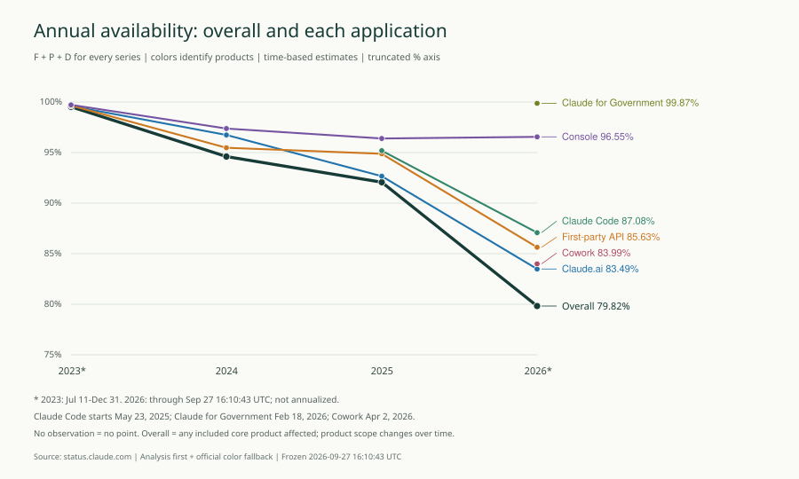

# Claude 事故根因与可靠性工程方向

复核日期：2026-09-28。事故与可用性数据仍冻结于 2026-09-27 16:10:43 UTC；范围为现有 Claude 报告的916起事故，4条维护排除。本次补充根因证据，不重算历史可用性。

## 开篇可用性摘要

以下统一采用 F∪P∪D。整体为任一纳入应用的影响区间并集，不是应用平均值。2026年整体为79.8238%；各应用差异与观察期如下。它们是公开事故时间估计，不是请求成功率或官方SLA。

| 整体／应用 | 2023 | 2024 | 2025 | 2026 至冻结时间 |
| --- | --- | --- | --- | --- |
| 整体（任一核心应用受影响） | 99.5268% * | 94.6056% | 92.0676% | 79.8238% * |
| Claude.ai | 99.5999% * | 96.7407% | 92.6644% | 83.4855% * |
| 第一方 API | 99.6510% * | 95.4748% | 94.8802% | 85.6341% * |
| Console | 99.7181% * | 97.3750% | 96.3921% | 96.5547% * |
| Claude Code | — | — | 95.1876% * | 87.0810% * |
| Cowork | — | — | — | 83.9939% * |
| Claude for Government（政府版） | — | — | — | 99.8707% * |

星号表示部分年度。2023从07-11开始；Claude Code的2025从05-23开始；Government和Cowork的2026分别从02-18、04-02开始；2026截止09-27 16:10:43 UTC。缺失年份不补零、不连线。新增产品与时间代理影响可比性；排除指定模型主动暂停后2026整体为86.4682%，该场景不替代主序列。

[年度图表源数据](../figures/02_annual_availability.csv) · [完整主报告](../../../Anthropic_Claude_Availability_Report_2026-09-27_v1.2.html)

## 根因分析结论

**不能把大多数事故的“错误率上升”归因为容量不足，也不能把“已找到根因”当作已公开根因。** 原报告32条vendor_stated占916起的3.49%，但这个字段混合了技术机制、触发因素、故障域和恢复动作；它不是32份完整RCA。本次将证据深度拆开，保留原字段以便审计。

| 证据层级 | 事故数 | 解释 |
| --- | --- | --- |
| 机制或直接失效方式 | 11 | 说明机制或直接失效方式，仍不等于追溯到组织和流程根因 |
| 触发变更或缺陷类型 | 9 | 确认发布、回归或缺陷，但底层实现原因未披露 |
| 故障域／依赖定位 | 11 | 只定位到依赖、服务或数据环节 |
| 仅恢复动作 | 1 | 上游实施修复；不能当作根因证明 |
| 现有材料未披露原因 | 880 | 现有证据无法定因 |
| 明确无用户影响 | 3 | 确认无用户影响，单列排除故障推论 |
| 主动服务暂停 | 1 | 主动暂停，单列业务连续性场景 |

总体最有依据的技术方向是：**发布与配置安全、语义质量可靠性、依赖隔离与任务恢复、客户端状态/兼容、数据与协议完整性、订阅权益一致性，以及贯穿各方向的可观测性。** 优先级是本研究基于影响范围、复现机制和控制能力提出的工程判断，不能从少量披露样本推出厂商全部故障的根因比例。

## 样本与归因边界

复用已完成的916起事故逐条语义复核；本次逐项核对32条已有归因的原始更新，并对全部916起更新文本做因果线索筛查，复查[29条候选记录](screened-candidates.json)。关键词筛查用于发现线索，不声称是独立的全量逐字复审。大多数候选只包含模板化“正在找根因”“部署修复”等文字；未据此补造新原因。手机验证及529记录只有故障链条/响应现象，不能升级为技术根因。

原始CSV保持不变；[916起逐事故根因台账](incident-root-causes.csv)为补充视图，每行保留原根因字段、证据深度、分类、原文引用、update_id、官方URL和原始对象SHA-256。维护不进入台账，3条明确无影响和1条主动暂停单列。unknown表示当前材料证据不足，不声称厂商从未发布过其他材料。

## 公开归因主题

| 主题 | 已有归因记录数 |
| --- | --- |
| 基础设施与依赖 | 11 |
| 客户端与软件兼容 | 6 |
| 变更与配置 | 4 |
| 数据与协议完整性 | 4 |
| 推理与输出质量 | 4 |
| 订阅与权益控制 | 2 |
| 证书与状态通信 | 1 |

分母仅为32条原vendor_stated记录，含1条本次降为“仅恢复动作”的记录；各记录只取一个主主题，多个触发因素在逐条解释中保留。主题计数不等于唯一底层故障数，也不等于总停机贡献；不同公告可能描述同一底层问题。未将各原因时长相加或计算“根因占停机百分比”。

## 代表性故障链及设计启示

- **变更可同时破坏网络和客户契约。** [2024-01-30 · brief partial outage of claude-instant-1.2, claude-2.1](https://status.claude.com/incidents/3667134hg62q)明确由负载均衡配置错误触发；[2026-05-06 · Connection failures for organizations restricting GitHub access by IP address](https://status.claude.com/incidents/snxm62gpxfc9)由出口IP变化撞上客户允许列表。工程启示是配置也要灰度和回滚，并将外部契约纳入发布验证。
- **HTTP成功不代表模型正确。** [2025-07-10 · Claude Sonnet 4 degraded performance quality](https://status.claude.com/incidents/4q9qw2g0nlcb)将质量和工具调用问题归因于推理栈发布。7月事件不能直接套用8月复盘的编译器原因。工程上需要任务质量与协议正确性门槛。
- **补充官方复盘。** 2025-09-17的[技术复盘](https://www.anthropic.com/engineering/a-postmortem-of-three-recent-issues)解释三类问题：上下文路由到错误服务池、TPU运行时配置导致输出异常、近似top-k编译缺陷。它明确部分模型关联仍不确定。只将补充归因关联到公告中直接链接该复盘的两条记录，原分析区间和事故数量保持不变。
- **故障恢复链也会失败。** [2025-10-03 · Claude.ai, Claude Code, API, and console are experiencing degraded service](https://status.claude.com/incidents/gr1vrcvz9jd4)称上游错误暴露内部问题并延长恢复；[2026-08-28 · Elevated errors on Claude Code and Claude Cowork](https://status.claude.com/incidents/vr9tpk8w7zr8)涉及长任务会话断开。应验证依赖隔离、任务检查点和恢复后的积压处理，而非只验证正常调用。
- **客户端包含持久状态和日历边界。** [2026-02-26 · Claude Code showing "JSON Parse error: Unexpected EOF" and writing excessive files on Windows](https://status.claude.com/incidents/3kjy2zn2w2bj)披露配置并发写争用；[2026-03-08 · Claude Desktop app unresponsive](https://status.claude.com/incidents/pqpgkf52p3tg)披露夏令时解析无限循环。对应的是原子写、并发协调和有界时间解析，不是泛泛增加服务器。
- **交易完成与权益生效是两步。** [2025-12-05 · iOS Subscription Access Issues](https://status.claude.com/incidents/6rrnsb1y0kbn)新购买路径修好后仍需补偿既有用户。需区分前向修复与存量恢复，并验证对账闭环。

## 可靠性工程技术方向与验收

下表的方案是研究建议，不代表已知Anthropic缺少这些控制，也不是已经实施的改进。先建立业务SLO与基线，再定阈值；不从公开状态页反推内部容量、团队流程或具体架构。

| 优先级 | 技术方向 | 直接事故证据 | 建议能力与实现 | 验收观测 |
| --- | --- | --- | --- | --- |
| P0 | 可观测性与事故通信 | [2026-08-14 · Issues reaching status.claude.com](https://status.claude.com/incidents/kmbpgrsszf72) | 将HTTP成功、首token/完成时延、工具调用和最终任务完成率分开；关联模型、路由池、发布版本、硬件、客户端版本；状态页独立探测证书和可达性。 建立可追踪请求样本和隐私保护反馈通道，记录检测/恢复时间。 | 演练业务失败但HTTP 200、状态页证书失效；核查任务SLI和告警是否触发。 |
| P0 | 发布与配置安全 | [2024-01-30 · brief partial outage of claude-instant-1.2, claude-2.1](https://status.claude.com/incidents/3667134hg62q)；[2026-05-06 · Connection failures for organizations restricting GitHub access by IP address](https://status.claude.com/incidents/snxm62gpxfc9)；[2025-10-20 · Claude.ai is unavailable](https://status.claude.com/incidents/kfs1w8vywj9d) | 代码、模型、代理、路由和配置均纳入渐进发布；按真实租户/地域/客户端选金丝雀，配置检查覆盖出口IP及客户允许列表契约；保留回退版本。 发布绑定错误率、质量和任务成功门槛；定义自动停止与可验证回滚。 | 错误配置注入与回滚演练；测量坏版本暴露范围、检测时间、回退完成时间。 |
| P0 | 语义质量可靠性 | [2025-07-10 · Claude Sonnet 4 degraded performance quality](https://status.claude.com/incidents/4q9qw2g0nlcb)；[2025-08-29 · Claude Opus 4.1 and Opus 4 degraded quality](https://status.claude.com/incidents/h26lykctfnsz)；[2025-09-09 · Model output quality](https://status.claude.com/incidents/72f99lh1cj2c) | 把“成功响应但质量错误”作为失败类别；使用工具调用结构校验、长短上下文、多轮会话与硬件/精度/批次矩阵差分评估。 在真实服务路径持续运行合成质量探针；将路由与推理版本关联到异常样本。 | 验证已知异常用例能阻断变更，统计质量回归漏检及误报；不要求随机生成逐字一致。 |
| P1 | 依赖隔离与恢复 | [2024-08-08 · Elevated error rates on 3.5 Sonnet and 3 Opus](https://status.claude.com/incidents/q5dvt5ph7tzx)；[2025-06-12 · Elevated errors on the API, Console and Claude.ai](https://status.claude.com/incidents/kn7mvrgb0c8m)；[2025-10-03 · Claude.ai, Claude Code, API, and console are experiencing degraded service](https://status.claude.com/incidents/gr1vrcvz9jd4)；[2026-08-28 · Elevated errors on Claude Code and Claude Cowork](https://status.claude.com/incidents/vr9tpk8w7zr8) | 按故障域隔离连接池、配额和任务队列；超时预算、单层有界重试与抖动；验证备用路径不共享同一依赖。 对工具副作用使用幂等键与结果对账；长任务检查点恢复，明确重试和切换条件。 | 注入依赖超时/断连，测量重试放大、恢复后积压排空、重复副作用和任务恢复率。 |
| P1 | 客户端状态与兼容 | [2026-02-26 · Claude Code showing "JSON Parse error: Unexpected EOF" and writing excessive files on Windows](https://status.claude.com/incidents/3kjy2zn2w2bj)；[2026-03-08 · Claude Desktop app unresponsive](https://status.claude.com/incidents/pqpgkf52p3tg)；[2026-04-25 · Claude Code v2.1.120 Crashes on Startup](https://status.claude.com/incidents/zqsk02ryfmrd)；[2026-09-10 · Degraded functionality for Claude Cowork on Windows](https://status.claude.com/incidents/r1pqn1kb4hvk) | 配置使用原子写与并发协调；会话格式迁移可回退；调度明确夏令时缺失/重复小时语义；测试OS升级及沙箱文件访问。 建立Windows/macOS、旧会话、并发进程、时区和系统更新兼容矩阵。 | 故障注入验证写入中断不损坏配置、调度有界终止、旧会话恢复和工作区访问正确。 |
| P1 | 数据与协议完整性 | [2024-06-03 · Images Cropped to Square](https://status.claude.com/incidents/vyw1vz0h6c1x)；[2025-05-09 · Elevated errors on Research](https://status.claude.com/incidents/926d2gm87s8c)；[2025-08-25 · Claude.ai failing to connect to certain MCP servers](https://status.claude.com/incidents/34c8pmy9lb6b)；[2026-03-31 · Unavailable connectors in Claude.ai desktop applications](https://status.claude.com/incidents/z5scppyhphjk) | 为图片尺寸、引用持久化、MCP协议协商和连接器允许列表建立端到端不变量；区分模型拿到数据与用户最终看到数据。 加入写后读核验、协议能力矩阵及配置差异审计。 | 验证引用保留率、图片变换正确性、协议回退成功率、允许列表误删恢复。 |
| P1 | 订阅与权益一致性 | [2025-12-05 · iOS Subscription Access Issues](https://status.claude.com/incidents/6rrnsb1y0kbn)；[2026-07-17 · Elevated errors across Fable 5](https://status.claude.com/incidents/g613ntyj2pwf)；[2026-09-16 · Issues with Google Play subscriptions](https://status.claude.com/incidents/t8fpw9vcshl9) | 交易与权益分离状态机但可对账；处理重复/乱序/延迟支付事件；按既定授权规则处理供应商故障。 覆盖免费/付费/已购用户合成旅程；修复新交易和补偿存量权益分别验证。 | 测量付款到权益生效时延、错误拒绝访问率、存量漏补数量；不以放宽认证代替恢复。 |
| P2 | 容量与服务连续性 | [2025-11-25 · Elevated errors for requests to Claude Opus 4.5](https://status.claude.com/incidents/5g213mxxlbsw)；[2026-06-13 · We’ve suspended access to Claude Mythos 5 and Claude Fable 5](https://status.claude.com/incidents/s9w82lp9dcn9) | 529只能证明过载响应现象，不能证明GPU不足；先采集队列等待、并发、token吞吐和请求长度，再评估准入、背压及容量余量。主动模型暂停另作业务连续性场景。 压测混合长短请求并设计明确授权的替代模型/异步处理路径；不绕过主动暂停。 | 测量饱和拐点、重试放大和降级后的任务质量；生产目标依据业务SLO与基线确定。 |

发布灰度的代表性选择与对照评价可参考[Google SRE发布工程](https://sre.google/workbook/canarying-releases/)。重试应受次数和时间预算约束，并采用退避与抖动，可参考[AWS重试控制](https://docs.aws.amazon.com/wellarchitected/2022-03-31/framework/rel_mitigate_interaction_failure_limit_retries.html)。这些工程资料用于支撑设计方向，不作为Claude事故归因证据。

## 建议推进顺序

第一阶段建立任务SLI、请求到发布版本的关联、证据分层和复盘模板，同时验证配置回滚与真实路径质量探针。第二阶段围绕已出现的具体机制建设兼容矩阵、协议契约、权益对账与依赖恢复演练。第三阶段根据运行基线决定容量投入、备用模型或供应商路径，并定期复测故障注入与恢复质量。该顺序是建议，不是交付工期承诺。

应收集的新增证据包括：事故触发版本、变更ID、检测渠道、真实影响范围、恢复动作及其结果、复发原因和控制缺口。没有这些数据时，不能量化改进后可用性提升，也不能给出可信的容量或投资回报预测。

## 32条已有归因记录的逐项复核

| 事故 | 主主题 | 证据深度 | 复核结论 |
| --- | --- | --- | --- |
| [2024-01-30 · brief partial outage of claude-instant-1.2, claude-2.1](https://status.claude.com/incidents/3667134hg62q) | 变更与配置 | 机制或直接失效方式 | 负载均衡配置错误；回滚恢复。配置为何未被验证未披露。 |
| [2024-04-30 · Claude Instant 1.2 Partial Outage](https://status.claude.com/incidents/0qyp857kns2b) | 变更与配置 | 触发变更或缺陷类型 | 维护操作使集群部分不可用；维护步骤及防护失效未披露。 |
| [2024-06-03 · Images Cropped to Square](https://status.claude.com/incidents/vyw1vz0h6c1x) | 数据与协议完整性 | 触发变更或缺陷类型 | 图像处理缺陷导致图片被裁为正方形；代码机制未披露。 |
| [2024-08-06 · High error rates affecting inference](https://status.claude.com/incidents/qn4crqd8ym36) | 基础设施与依赖 | 故障域／依赖定位 | 仅披露后端服务临时中断，不能进一步归因为容量或网络。 |
| [2024-08-08 · Elevated error rates on 3.5 Sonnet and 3 Opus](https://status.claude.com/incidents/q5dvt5ph7tzx) | 基础设施与依赖 | 故障域／依赖定位 | 上游基础设施问题；未说明底层机制，曾切换模型缓解。 |
| [2024-08-28 · Bug affecting responses in claude.ai](https://status.claude.com/incidents/kygj9sjs8dxr) | 推理与输出质量 | 触发变更或缺陷类型 | 官方确认回复一致性缺陷，并明确无提示泄漏；更深机制未知。 |
| [2024-10-24 · Claude 3.5 Sonnet elevated error rate](https://status.claude.com/incidents/7gftd1ybnk3v) | 基础设施与依赖 | 故障域／依赖定位 | 指定模型的基础设施问题；不能推断硬件或GPU原因。 |
| [2025-05-09 · Elevated errors on Research](https://status.claude.com/incidents/926d2gm87s8c) | 数据与协议完整性 | 故障域／依赖定位 | 来源送达模型却未持久化到聊天，定位到数据链路但写入失败原因未知。 |
| [2025-06-12 · Elevated errors on the API, Console and Claude.ai](https://status.claude.com/incidents/kn7mvrgb0c8m) | 基础设施与依赖 | 故障域／依赖定位 | 明确依赖GCP及关联服务故障；本记录未给出供应商底层机制。 |
| [2025-07-10 · Claude Sonnet 4 degraded performance quality](https://status.claude.com/incidents/4q9qw2g0nlcb) | 推理与输出质量 | 触发变更或缺陷类型 | 推理栈发布导致质量退化，回滚；不套用其他月份复盘的编译器原因。 |
| [2025-08-22 · Intermittent visibility issues with Google Docs in project knowledge base](https://status.claude.com/incidents/zr0lqy5rpx9w) | 客户端与软件兼容 | 触发变更或缺陷类型 | 确认回归缺陷，未披露具体变更或代码。 |
| [2025-08-25 · Claude.ai failing to connect to certain MCP servers](https://status.claude.com/incidents/34c8pmy9lb6b) | 数据与协议完整性 | 机制或直接失效方式 | 部分MCP连接无法降级至SSE；协议回退为何失败仍未知。 |
| [2025-08-29 · Claude Opus 4.1 and Opus 4 degraded quality](https://status.claude.com/incidents/h26lykctfnsz) | 推理与输出质量 | 机制或直接失效方式 | 公告确认推理栈发布；关联官方复盘进一步说明TPU运行时配置与优化导致输出异常。 |
| [2025-09-09 · Model output quality](https://status.claude.com/incidents/72f99lh1cj2c) | 推理与输出质量 | 机制或直接失效方式 | 关联复盘披露上下文路由错误及近似top-k编译问题；同一公告涉及多机制，不按一因一事故计。 |
| [2025-10-03 · Claude.ai, Claude Code, API, and console are experiencing degraded service](https://status.claude.com/incidents/gr1vrcvz9jd4) | 基础设施与依赖 | 故障域／依赖定位 | 上游错误暴露内部基础设施问题并拖慢恢复；双方具体机制未披露。 |
| [2025-10-17 · Claude Desktop is unavailable](https://status.claude.com/incidents/m05thlr411w6) | 客户端与软件兼容 | 触发变更或缺陷类型 | 确认客户端代码问题，未披露触发路径。 |
| [2025-10-20 · Claude.ai is unavailable](https://status.claude.com/incidents/kfs1w8vywj9d) | 变更与配置 | 触发变更或缺陷类型 | 错误边缘代理部署触发故障，回滚后仍在调查深层原因。 |
| [2025-11-18 · Elevated errors on claude.ai](https://status.claude.com/incidents/p0svq4j6sk04) | 基础设施与依赖 | 故障域／依赖定位 | 只确认第三方供应商故障，未给出供应商名称与技术机制。 |
| [2025-12-05 · Claude.ai is unavailable](https://status.claude.com/incidents/49cmvxrrk228) | 基础设施与依赖 | 仅恢复动作 | 仅说明上游已实施修复；可确认恢复动作，不能据此认定技术根因。 |
| [2025-12-05 · iOS Subscription Access Issues](https://status.claude.com/incidents/6rrnsb1y0kbn) | 订阅与权益控制 | 触发变更或缺陷类型 | iOS指定版本引入购买激活缺陷；新购修复后，存量权益仍需修复。 |
| [2026-02-26 · Outage in usage reporting](https://status.claude.com/incidents/9s03yn69ky6m) | 基础设施与依赖 | 故障域／依赖定位 | 内部数据服务影响报表及分析接口；具体数据故障机制未披露。 |
| [2026-02-26 · Claude Code showing "JSON Parse error: Unexpected EOF" and writing excessive files on Windows](https://status.claude.com/incidents/3kjy2zn2w2bj) | 客户端与软件兼容 | 机制或直接失效方式 | Windows配置文件并发写争用，产生非确定性损坏；已知关联客户端版本。 |
| [2026-03-06 · Elevated TCP three-way handshake failures on api.anthropic.com](https://status.claude.com/incidents/htjkfrfnzq12) | 基础设施与依赖 | 故障域／依赖定位 | 上游对等互联点网络退化导致连接超时；链路退化原因未披露。 |
| [2026-03-08 · Claude Desktop app unresponsive](https://status.claude.com/incidents/pqpgkf52p3tg) | 客户端与软件兼容 | 机制或直接失效方式 | 夏令时跳过小时使任务时间解析无法收敛，应用进入无限循环。 |
| [2026-03-31 · Unavailable connectors in Claude.ai desktop applications](https://status.claude.com/incidents/z5scppyhphjk) | 数据与协议完整性 | 机制或直接失效方式 | 连接器被从组织允许列表移除导致不可用；移除的深层原因未披露。 |
| [2026-04-25 · Claude Code v2.1.120 Crashes on Startup](https://status.claude.com/incidents/zqsk02ryfmrd) | 客户端与软件兼容 | 触发变更或缺陷类型 | 指定客户端版本恢复旧会话时崩溃；底层代码缺陷未披露。 |
| [2026-05-06 · Connection failures for organizations restricting GitHub access by IP address](https://status.claude.com/incidents/snxm62gpxfc9) | 变更与配置 | 机制或直接失效方式 | 基础设施变更改变GitHub连接出口IP，与客户IP允许列表不兼容。 |
| [2026-07-17 · Elevated errors across Fable 5](https://status.claude.com/incidents/g613ntyj2pwf) | 订阅与权益控制 | 机制或直接失效方式 | 错误要求使用量额度，使本应可用的模型访问被拒绝。 |
| [2026-08-14 · Issues reaching status.claude.com](https://status.claude.com/incidents/kmbpgrsszf72) | 证书与状态通信 | 机制或直接失效方式 | 状态站点证书无效；不能进一步断言是到期或自动续期失败。 |
| [2026-08-28 · Elevated errors on Claude Code and Claude Cowork](https://status.claude.com/incidents/vr9tpk8w7zr8) | 基础设施与依赖 | 故障域／依赖定位 | 上游云服务问题造成远程会话失败或断开，具体机制未披露。 |
| [2026-09-10 · Degraded functionality for Claude Cowork on Windows](https://status.claude.com/incidents/r1pqn1kb4hvk) | 客户端与软件兼容 | 机制或直接失效方式 | Windows更新使Cowork工作区失去本机磁盘访问，涉及外部系统兼容。 |
| [2026-09-16 · Issues with Google Play subscriptions](https://status.claude.com/incidents/t8fpw9vcshl9) | 基础设施与依赖 | 故障域／依赖定位 | Google Play确认服务问题，影响订阅；未披露技术机制。 |

## 复算与验证

[完整逐事故台账](incident-root-causes.csv) · [人工判断映射](review-decisions.json) · [统计结果](summary.json) · [新增来源与范围说明](source-notes.json) · [验证记录](verification.json) · [生成程序](build.py)。源CSV SHA-256：`4aa72387190eaa3be98fb337ad886312d2f6aff8b7bb6b366309169612b3e0a9`。
