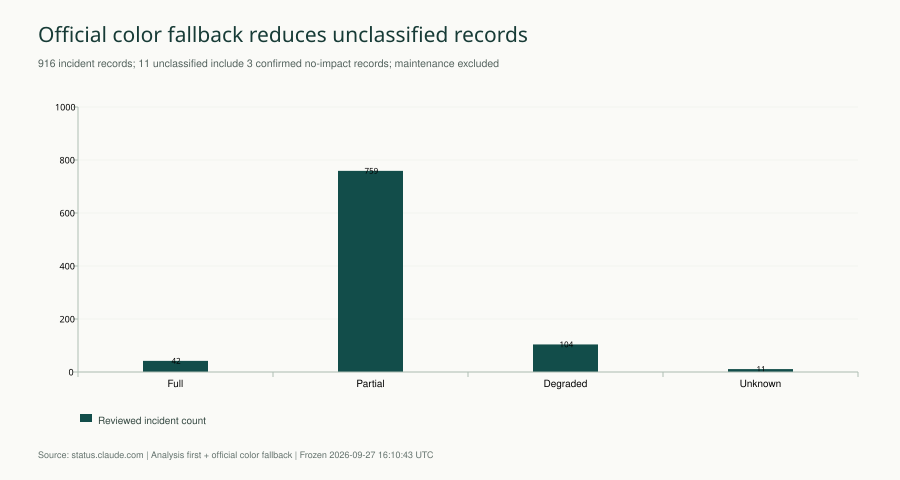
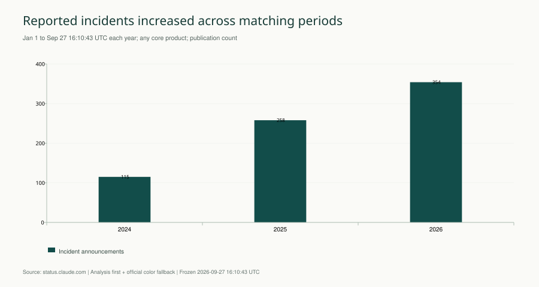
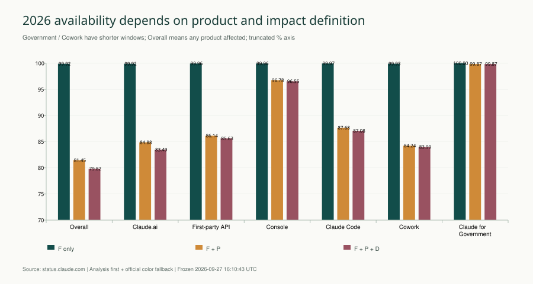
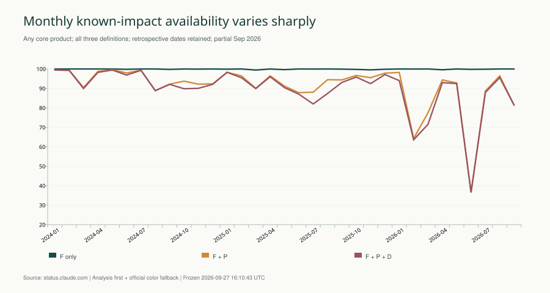
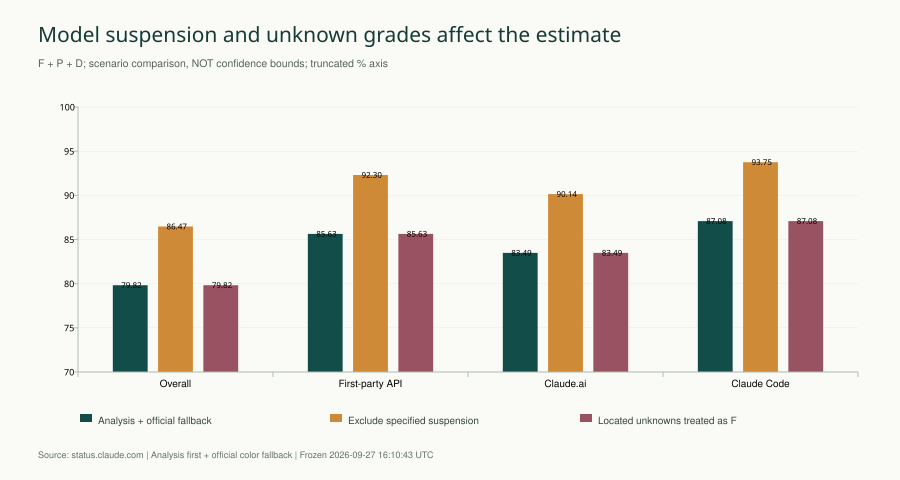

# Claude 可用性与事故复核报告

**Anthropic · v1.2 分析优先、官方颜色兜底 · 冻结截止 2026-09-27 16:10:43 UTC**

## 年度可用性总结

**按 F∪P∪D（完整不可用、局部不可用及性能或质量退化）口径，核心服务并集的可用性估计从 2023 年观察期的 99.5268%，降至 2024 年的 94.6056%、2025 年的 92.0676%，2026 年截至冻结时间为 79.8238%。** 其中两个完整年度 2024→2025 下降 2.54 个百分点；只计 F 的各年估计均高于 99.8%，纳入 P、D 后下降更明显。

**各应用摘要：** 2026 年截至冻结时间，Claude.ai 为 **83.4855%**，第一方 API 为 **85.6341%**，Claude Code 为 **87.0810%**；Console 为 **96.5547%**。Cowork 与 Claude for Government（政府版）分别为 **83.9939% / 99.8707%**，但观察期更短，不能据此直接排名。

下表与同一张折线图统一采用 **F∪P∪D** 口径，将整体和六个应用放在一起比较；F、F∪P 的明细保留在后文及年度结果 CSV。**图中颜色区分应用／整体，不代表事故等级。**

| 整体／应用 | 2023 | 2024 | 2025 | 2026 截至冻结时间 | 观察起点 UTC |
| --- | --- | --- | --- | --- | --- |
| 整体（任一核心应用受影响） | 99.5268% * | 94.6056% | 92.0676% | 79.8238% * | 2023-07-11 |
| Claude.ai | 99.5999% * | 96.7407% | 92.6644% | 83.4855% * | 2023-07-11 |
| 第一方 API | 99.6510% * | 95.4748% | 94.8802% | 85.6341% * | 2023-07-11 |
| Console | 99.7181% * | 97.3750% | 96.3921% | 96.5547% * | 2023-07-11 |
| Claude Code | —（未进入观察期） | —（未进入观察期） | 95.1876% * | 87.0810% * | 2025-05-23 |
| Cowork | —（未进入观察期） | —（未进入观察期） | —（未进入观察期） | 83.9939% * | 2026-04-02 |
| Claude for Government（政府版） | —（未进入观察期） | —（未进入观察期） | —（未进入观察期） | 99.8707% * | 2026-02-18 |

星号（*）表示该应用当年仅有部分年度观察期；“—”表示尚未进入观察期，未填为 0% 或 100%。2023 年均从 07-11 开始；Claude Code 的 2025 年从 05-23 开始；Claude for Government、Cowork 的 2026 年分别从 02-18、04-02 开始。2026 年统一截止 09-27 16:10:43 UTC。单个年度数据仅画一个点，不向此前年份延伸。

图 1：年度可用性趋势折线图；整体与六个应用统一采用 F∪P∪D 口径，颜色区分应用，右侧标注最新观察值；缺少观察的年份不连线，纵轴截短至75%。可下载 [PNG](2026-09-27/v1.2/figures/02_annual_availability.png)、[SVG](2026-09-27/v1.2/figures/02_annual_availability.svg)、[图表数据](2026-09-27/v1.2/figures/02_annual_availability.csv)。

**阅读结论的边界：** 2023 年从 7 月 11 日开始，2026 年仅截至 9 月 27 日，均不是全年结果，也未作年化预测。核心服务并集表示“任一纳入产品受影响”；新增产品、公开披露粒度、时间代理和观察期长短都会影响可比性。2026 年结果包含指定模型的主动访问暂停；排除该事件并重算重叠区间后，F∪P∪D 为 **86.4682%**。这些数字是公开事故记录推导的时间估计，不能解释为真实请求成功率或官方 SLA。

来源：[Claude 官方状态站](https://status.claude.com)、[History](https://status.claude.com/history)。本版沿用 v1.0 冻结原始证据和 v1.1 全量语义审阅，按用户要求对无法判断的等级使用官方颜色兜底，重新计算并更新六组图表。

> 920 条记录均已完成复核，其中 916 起事故、4 条维护。原104条unknown中有 **93条通过官方等级兜底定级**；现有11条编码为unknown，其中3条明确无影响、8条缺少可用等级证据。80条没有可纳入主序列的分析时间段。以下数字是公开记录的时间可用性估计，包含明确标记的状态/公告代理；不是请求成功率或官方 SLA。

## 一、2026 年已知影响估计随故障定义而变化

核心服务并集的 **F 口径为 99.9183%，F∪P 为 81.4548%，F∪P∪D 为 79.8238%**。F包含分析确认的完整不可用与官方红色兜底，P包含分析局部不可用与官方橙色兜底，D包含分析退化与官方黄色兜底；Overall 指任一纳入产品发生相应影响。

第一方 API 的三种口径分别为 **99.9601% / 86.1382% / 85.6341%**。这是 API 产品及其功能的时间指标，不是模型调用成功率，不能按用户或请求量解释。

指定模型的主动访问暂停是重要长事件。将这条记录排除并重新合并重叠区间后，核心服务并集的 F∪P∪D 估计变为 **86.4682%**，相比主序列变化 **6.64 个百分点**。两种口径一并展示，不将安全性主动暂停悄悄剔除。

## 二、分析结论优先，无法判断时按官方颜色定级

| 等级 | 判定条件 | 常见边界 |
| --- | --- | --- |
| F | 分析证明完整不可用；分析未知时官方红色兜底 | 官方兜底不证明整个产品完全停机 |
| P | 分析证明局部不可用；分析未知时官方橙色兜底 | 不覆盖已确定的分析等级 |
| D | 分析证明性能或质量退化；分析未知时官方黄色兜底 | 时间证据仍需单独判断 |
| unknown | 分析及官方颜色均不能定级，或已确认无影响而单独标记 | 无影响记录不计时长；缺失不填0 |

只写“错误率升高”、分析无法判定的阶段，优先采用该产品相应时段的官方组件颜色；没有对应阶段颜色时采用事故级 impact 标签。已经明确的分析等级、服务归属和时间边界保持不变。官方未定级且无可用历史组件颜色时才继续保留未知。

共有 **109条记录、531个阶段** 使用官方兜底，其中93条原事故等级为unknown，其余是混合等级事故中的未知阶段。官方字段和原分析结论均完整保留；[兜底调整明细](2026-09-27/v1.2/官方颜色兜底调整明细.md) 可逐条查看来源。

[完整事故等级与时间定义](2026-09-27/v1.2/事故等级定义.md) 给出判定标准、未知处理、代理边界和根因定义。

图 2：分析优先、官方颜色兜底后的有效等级分布；unknown含3条明确无影响记录。可下载 [PNG](2026-09-27/v1.2/figures/06_reviewed_grades.png)、[SVG](2026-09-27/v1.2/figures/06_reviewed_grades.svg)、[图表数据](2026-09-27/v1.2/figures/06_reviewed_grades.csv)。

## 三、公开历史有 916 起事故，近年公告数量增加

| 公告年份 UTC | 事故 | 维护 |
| --- | --- | --- |
| 2023 | 30 | 0 |
| 2024 | 188 | 3 |
| 2025 | 334 | 1 |
| 2026 | 364 | 0 |

共 2,919 条更新。最早公告为 2023-03-14，最新公告为 2026-09-22。2026 年未完结，不能直接用 364 起与前一完整年度比较。

图 3：相同起止月日比较核心服务事故公告数；不同年份服务构成仍有变化。可下载 [PNG](2026-09-27/v1.2/figures/01_same_period_counts.png)、[SVG](2026-09-27/v1.2/figures/01_same_period_counts.svg)、[图表数据](2026-09-27/v1.2/figures/01_same_period_counts.csv)。

History 以三个月为一页，共保存 16 页，末页为早于页面创建日的空季度。920 个 History ID 与 920 个详情对象完全匹配，覆盖状态为 **enumerated**。这是公开可访问 History 的枚举，不证明未公开或删除的事故不存在。列表 API 第二页重复第一页，未用该接口的伪分页证明完整性。

采集证据见 [原始快照](2026-09-27/v1.0/snapshot.json)、[History 枚举轨迹](2026-09-27/v1.0/history-index.json)、[v1.0 原始 HTTP 证据目录说明](2026-09-27/v1.0/README.md)。交叉检查为 History 内嵌数据与详情 ID 对照，未声称浏览器逐页视觉核验。

## 四、观察窗口与重叠去重决定分母和分子

| 服务 | 观察开始 UTC | 观察结束 UTC |
| --- | --- | --- |
| 整体（任一核心应用受影响） | 2023-07-11T00:00:00Z | 2026-09-27T16:10:43Z |
| Claude.ai | 2023-07-11T00:00:00Z | 2026-09-27T16:10:43Z |
| 第一方 API | 2023-07-11T00:00:00Z | 2026-09-27T16:10:43Z |
| Console | 2023-07-11T00:00:00Z | 2026-09-27T16:10:43Z |
| Claude Code | 2025-05-23T00:00:00Z | 2026-09-27T16:10:43Z |
| Cowork | 2026-04-02T00:00:00Z | 2026-09-27T16:10:43Z |
| Claude for Government（政府版） | 2026-02-18T00:00:00Z | 2026-09-27T16:10:43Z |

Claude.ai、API 和 Console 采用官方组件 start_date；较新服务采用组件创建后的首个完整 UTC 日，避免向组件出现之前回填“零故障”。这些日期是研究观察窗口，不能理解为产品上线日期。Overall 中每个产品仅在自身窗口内贡献区间；第三方 Vertex/Bedrock 与官网/文档/社交账号分别归 External/Other，排除核心服务。

**A = 1 − 对应等级影响时间的并集秒数 ÷ 观察窗口秒数。** 同事故阶段、产品之间、不同事故之间均去重；跨年分摊；维护排除。F、F∪P、F∪P∪D 分别重新计算，不能将事故小时或产品小时相加。

时间证据顺序为实际影响窗口、历史组件状态区间、有依据的公告活动周期代理。Monitoring 不自动当恢复；晚发复盘不延长影响；重开拆成多个阶段。日期或时区矛盾且无法消解时不编造精确时间。未知等级与无可定位阶段仍保留，**未进入分子的时间不等于已确认正常**。表中 100% 只表示没有可计量的对应等级区间，不表示证实全年零故障。

年度及月度 `incident_count` 按该产品首次已知分析影响时间归属，时间未知则按公告时间；另保留 `publication_count` 对照 History。两种数量不能混用。

## 五、2026 年产品可用性与对应影响小时数

图 4：2026 年产品时间可用性估计，纵轴截短以显示差异。可下载 [PNG](2026-09-27/v1.2/figures/03_product_availability.png)、[SVG](2026-09-27/v1.2/figures/03_product_availability.svg)、[图表数据](2026-09-27/v1.2/figures/03_product_availability.csv)。

| 服务 | 观察天数 | F 可用性 | F∪P 可用性 | F∪P∪D 可用性 | 全部等级小时 |
| --- | --- | --- | --- | --- | --- |
| 整体（任一核心应用受影响） | 269.67 | 99.9183% | 81.4548% | 79.8238% | 1,305.84 |
| Claude.ai | 269.67 | 99.9203% | 84.8787% | 83.4855% | 1,068.85 |
| 第一方 API | 269.67 | 99.9601% | 86.1382% | 85.6341% | 929.79 |
| Console | 269.67 | 99.9615% | 96.7773% | 96.5547% | 222.99 |
| Claude Code | 269.67 | 99.9680% | 87.6813% | 87.0810% | 836.14 |
| Cowork | 178.67 | 99.9292% | 84.2353% | 83.9939% | 686.37 |
| Claude for Government（政府版） | 221.67 | 100.0000% | 99.8707% | 99.8707% | 6.88 |

| 服务 | F 小时 | F∪P 小时 | F∪P∪D 小时 | 未知等级公告数 | 无主分析区间公告数 |
| --- | --- | --- | --- | --- | --- |
| 整体（任一核心应用受影响） | 5.29 | 1,200.28 | 1,305.84 | 1 | 23 |
| Claude.ai | 5.16 | 978.68 | 1,068.85 | 1 | 14 |
| 第一方 API | 2.58 | 897.16 | 929.79 | 0 | 11 |
| Console | 2.49 | 208.58 | 222.99 | 0 | 2 |
| Claude Code | 2.07 | 797.29 | 836.14 | 0 | 11 |
| Cowork | 3.04 | 676.02 | 686.37 | 0 | 6 |
| Claude for Government（政府版） | 0.00 | 6.88 | 6.88 | 0 | 1 |

Cowork 和 Claude for Government 的观察天数更短。更少的已披露事故或更短的观察历史不能单独证明更可靠。所有图表均附源数据，可在 [年度结果](2026-09-27/v1.2/annual-results.csv) 中复算。

## 六、年度和月度趋势反映已披露影响，而非请求成功率

整体与各应用的年度折线和百分比摘要见报告开头；下表补充各年的观察天数和去重影响小时数。

图 5：月度估计使用同一逐阶段口径；2026 年 9 月仅至冻结时间。可下载 [PNG](2026-09-27/v1.2/figures/05_monthly_availability.png)、[SVG](2026-09-27/v1.2/figures/05_monthly_availability.svg)、[图表数据](2026-09-27/v1.2/figures/05_monthly_availability.csv)。

| 年份 | 核心服务观察天数 | F | F∪P | F∪P∪D | 主序列影响小时 |
| --- | --- | --- | --- | --- | --- |
| 2023 | 174.00 | 99.9301% | 99.5335% | 99.5268% | 19.76 |
| 2024 | 366.00 | 99.9617% | 95.3429% | 94.6056% | 473.85 |
| 2025 | 365.00 | 99.8377% | 93.9245% | 92.0676% | 694.88 |
| 2026 | 269.67 | 99.9183% | 81.4548% | 79.8238% | 1,305.84 |

新增产品、披露粒度、未知事故比例和观察期长度都可能改变趋势。不能据此推导某项发布导致可靠性下降，也不能直接与本仓库 OpenAI 报告排名。同期比较见 [matched-window-results.csv](2026-09-27/v1.2/matched-window-results.csv)，月度细表见 [monthly-results.csv](2026-09-27/v1.2/monthly-results.csv)。

## 七、模型暂停和未知等级的敏感性需要并列呈现

图 6：敏感性场景重新合并区间，差异不是简单相减事故时长。可下载 [PNG](2026-09-27/v1.2/figures/04_sensitivity.png)、[SVG](2026-09-27/v1.2/figures/04_sensitivity.svg)、[图表数据](2026-09-27/v1.2/figures/04_sensitivity.csv)。

| 2026 核心并集场景 | F | F∪P | F∪P∪D | 含义 |
| --- | --- | --- | --- | --- |
| 主序列 | 99.9183% | 81.4548% | 79.8238% | 分析等级+官方兜底+标记代理 |
| 排除指定模型暂停 | 99.9183% | 88.1057% | 86.4682% | 排除单条主动暂停，重算并集 |
| 仅明确实际时间 | 99.9531% | 98.9293% | 98.0669% | 仅用于衡量时间证据覆盖，不能当真实上界 |
| 可定位未知等级均当 F | 99.9183% | 81.4548% | 79.8238% | 保守压力场景，不能当真实下界 |

暂停事件为 [We’ve suspended access to Claude Mythos 5 and Claude Fable 5](https://status.claude.com/incidents/s9w82lp9dcn9)，仅指定模型，产品范围为 P。相关官方说明见 [访问暂停说明](https://www.anthropic.com/news/fable-mythos-access) 与 [恢复说明](https://www.anthropic.com/news/redeploying-fable-5)。

2026年剩余未定级事故没有可用于当年核心服务统计的候选区间，因此当前“可定位未知均当F”与主序列相同；这不表示没有缺失影响。“可定位未知均当 F”只改变存在候选时间的未知等级事故；完全无法定位的事件仍无法量化。因此这些场景**不是上下界或置信区间**。间歇错误的公告覆盖时间也不等于连续失败时长。例如 skills 功能间歇错误公告的代理区间约 159.60 小时；单独排除标记为间歇影响包络的三条记录后，2026 核心服务全部等级估计为 **82.1638%**（仍包含模型暂停）。此场景用于展示连续包络假设的影响，不能证明这些时段正常。详见 [全部敏感性数据](2026-09-27/v1.2/sensitivity-2026.csv)。公开披露样本不是随机抽样，没有依据给出统计误差条；这里报告的是口径敏感性。

## 八、全量复核已完成，证据缺口仍明确保留

| 复核和证据项目 | 结果 |
| --- | --- |
| 已完成逐记录语义复核 | 920 / 920；待复核 0；不代表厂商全部真实故障已知 |
| 事故等级分布 | partial_outage: 759；full_outage: 42；degraded_performance: 104；unknown: 11 |
| 无可纳入主序列时间段 | 80 / 916；含未知等级、无定位时间、明确无用户影响等 |
| 完整实际影响时间线 | 142 / 916；其余可能仅部分精确或代理 |
| 阶段时间来源 | explicit_impact: 272；announcement_proxy: 370；official_component_interval: 2561；timezone_inferred: 13 |
| 根因审阅 | not_disclosed: 884；vendor_stated: 32 |
| 明确无用户影响 | 3 条，保留公告但排除时长 |
| 结构校验 | 48 列、UTF-8 BOM、920 唯一 ID、原始 JSON 哈希、引文、正长度、UTC、并集一致性 |

v1.2 基础分析仅调整无法判定的等级，保留 v1.1 已确认分析阶段；官方兜底阶段绑定原始字段、更新ID和组件ID。时间缺失仍缺失；重开、分服务、真实窗口优先和无用户影响排除规则继续生效。红色兜底按F统计，但不能解读为已从正文证明全产品不可用。

原分析的未知结论及兜底来源都有记录级理由，可从 CSV 的 `evidence_json.assessment` 与 HTML 索引检索。上一轮额外技术复盘的完整 HTTP 下载返回 403，已停止该路径。2026-09-28 本次通过网页读取工具取得关联官方复盘正文，用于根因专题的补充归因；仍未归档原始 HTTP 字节，冻结 CSV 的根因字段保留原结论。根因 not_disclosed 仅表示在对应轮次已取得材料中未明确披露。

可用于公开事故基线、功能风险识别与监测设计。用于生产 SLO 或供应商比较前，还需请求量、模型/地域分布、成功率、延迟分位数、重试后任务完成率和输出质量评测。

## 九、事故根因与可靠性工程方向（2026-09-28补充复核）

916起事故中，原32条vendor_stated仅占3.49%，且并非都有完整技术根因。本次区分：11条机制或直接失效方式、9条触发变更/缺陷、11条故障域定位、1条仅恢复动作；另有880条现有材料未披露原因、3条明确无影响、1条主动暂停。证据不足时不推断为GPU、容量或网络故障。

优先方向为发布与配置安全、语义质量可靠性和可观测性；随后完善依赖隔离与任务恢复、客户端兼容、数据/协议完整性、订阅权益一致性。方向与验收指标基于有明确证据的案例推导，属于研究建议，不是厂商内部控制缺失的事实。

| 方向 | 对应事故机制或现象 | 建议验证重点 |
| --- | --- | --- |
| 可观测性与事故通信 | [2026-08-14 · Issues reaching status.claude.com](https://status.claude.com/incidents/kmbpgrsszf72) | 演练业务失败但HTTP 200、状态页证书失效；核查任务SLI和告警是否触发。 |
| 发布与配置安全 | [2024-01-30 · brief partial outage of claude-instant-1.2, claude-2.1](https://status.claude.com/incidents/3667134hg62q)；[2026-05-06 · Connection failures for organizations restricting GitHub access by IP address](https://status.claude.com/incidents/snxm62gpxfc9) | 错误配置注入与回滚演练；测量坏版本暴露范围、检测时间、回退完成时间。 |
| 语义质量可靠性 | [2025-07-10 · Claude Sonnet 4 degraded performance quality](https://status.claude.com/incidents/4q9qw2g0nlcb)；[2025-08-29 · Claude Opus 4.1 and Opus 4 degraded quality](https://status.claude.com/incidents/h26lykctfnsz) | 验证已知异常用例能阻断变更，统计质量回归漏检及误报；不要求随机生成逐字一致。 |
| 依赖隔离与恢复 | [2024-08-08 · Elevated error rates on 3.5 Sonnet and 3 Opus](https://status.claude.com/incidents/q5dvt5ph7tzx)；[2025-06-12 · Elevated errors on the API, Console and Claude.ai](https://status.claude.com/incidents/kn7mvrgb0c8m) | 注入依赖超时/断连，测量重试放大、恢复后积压排空、重复副作用和任务恢复率。 |
| 客户端状态与兼容 | [2026-02-26 · Claude Code showing "JSON Parse error: Unexpected EOF" and writing excessive files on Windows](https://status.claude.com/incidents/3kjy2zn2w2bj)；[2026-03-08 · Claude Desktop app unresponsive](https://status.claude.com/incidents/pqpgkf52p3tg) | 故障注入验证写入中断不损坏配置、调度有界终止、旧会话恢复和工作区访问正确。 |
| 数据与协议完整性 | [2024-06-03 · Images Cropped to Square](https://status.claude.com/incidents/vyw1vz0h6c1x)；[2025-05-09 · Elevated errors on Research](https://status.claude.com/incidents/926d2gm87s8c) | 验证引用保留率、图片变换正确性、协议回退成功率、允许列表误删恢复。 |
| 订阅与权益一致性 | [2025-12-05 · iOS Subscription Access Issues](https://status.claude.com/incidents/6rrnsb1y0kbn)；[2026-07-17 · Elevated errors across Fable 5](https://status.claude.com/incidents/g613ntyj2pwf) | 测量付款到权益生效时延、错误拒绝访问率、存量漏补数量；不以放宽认证代替恢复。 |
| 容量与服务连续性 | [2025-11-25 · Elevated errors for requests to Claude Opus 4.5](https://status.claude.com/incidents/5g213mxxlbsw)；[2026-06-13 · We’ve suspended access to Claude Mythos 5 and Claude Fable 5](https://status.claude.com/incidents/s9w82lp9dcn9) | 测量饱和拐点、重试放大和降级后的任务质量；生产目标依据业务SLO与基线确定。 |

详细的证据分层、32条归因逐项复核及工程方案见 [根因与可靠性工程专题](2026-09-27/v1.2/root-cause-review/Claude_事故根因与可靠性工程方向.html)（[Markdown](2026-09-27/v1.2/root-cause-review/Claude_事故根因与可靠性工程方向.md)）；[916起逐事故根因台账](2026-09-27/v1.2/root-cause-review/incident-root-causes.csv)保留每起的原字段、证据及判断。本次补充读取两条事故直接关联的官方技术复盘；不改变冻结事故数据、等级、时间区间和可用性数值。

## 十、交付物与复算入口

- [单一事故 CSV](2026-09-27/v1.2/incidents.csv)：48 列、完整原始对象与更新、复核判断、证据及时间阶段。
- [全量分析](2026-09-27/v1.2/analysis.json)、[分析区间](2026-09-27/v1.2/assessed-intervals.json)、[窗口配置](2026-09-27/v1.2/service_windows.json)、[年度/月度趋势 JSON](2026-09-27/v1.2/trend_data.json)。
- [CSV 结构验证](2026-09-27/v1.2/incidents.validation.json)、[独立验证](2026-09-27/v1.2/verification.json)、[敏感性结果](2026-09-27/v1.2/sensitivity-2026.csv)。
- [生成和复算说明](2026-09-27/v1.2/README.md)、[分析程序](2026-09-27/v1.2/tools/analyze.py)、[绘图程序](2026-09-27/v1.2/tools/charts.py)、[报告程序](2026-09-27/v1.2/tools/build_report.py)。

CSV SHA-256：`4aa72387190eaa3be98fb337ad886312d2f6aff8b7bb6b366309169612b3e0a9`。规范化对象哈希与原始 HTTP 字节哈希分开保存。本版与生成程序、数据和历史版本一并纳入仓库管理。

## 附录：判为 F 的记录仍需按产品和阶段解读

| 日期 | 事故 | 服务 | 判断 |
| --- | --- | --- | --- |
| 2023-04-28 | [Brief model downtime](https://status.claude.com/incidents/cbnwvjjmr26h) | API | 所有当时模型暂时离线，API 请求返回404，判 API 完全不可用。 时间：按原文实际UTC时间窗；若时间基础为代理则非完整真实时间。 |
| 2023-06-07 | [Outage causing 500s across multiple models](https://status.claude.com/incidents/5dcd2h34gbcg) | API | 分析优先、官方颜色兜底：有效等级 full_outage；原分析结论：已核阅完整公告；仅报告错误升高或笼统异常，没有可判全量或部分失败的对象边界，等级保留未知。 时间：无完整实际起止；仅可按历史组件状态或公告时间代理，监控不自动等于恢复。 |
| 2023-07-10 | [API Outage](https://status.claude.com/incidents/svk9pskgp576) | API | 公告明确声明所列服务不可访问或停止工作，仅按声明的服务范围判为完全不可用。 时间：无完整实际起止；仅可按历史组件状态或公告时间代理，监控不自动等于恢复。 |
| 2023-07-10 | [anthropic.com is down but the API and Console are still available](https://status.claude.com/incidents/61k4r5c1xzfj) | Other | 公告明确声明所列服务不可访问或停止工作，仅按声明的服务范围判为完全不可用。 时间：无完整实际起止；仅可按历史组件状态或公告时间代理，监控不自动等于恢复。 |
| 2023-08-04 | [claude.ai down & API partially degraded](https://status.claude.com/incidents/rl5dxx1dvn2b) | API, Claude.ai, Console | Claude.ai 停止访问，API/Console仅退化；拆分服务等级，不能整段全服务按F。 时间：按原文实际UTC时间窗；若时间基础为代理则非完整真实时间。 |
| 2024-01-22 | [claude.ai chat not operational](https://status.claude.com/incidents/3ssrcy8kwsx9) | Claude.ai | 公告明确声明所列服务不可访问或停止工作，仅按声明的服务范围判为完全不可用。 时间：无完整实际起止；仅可按历史组件状态或公告时间代理，监控不自动等于恢复。 |
| 2024-01-31 | [Claude.ai Experienced a Temporary Outage](https://status.claude.com/incidents/shhpbrjb160c) | Claude.ai | 公告明确声明所列服务不可访问或停止工作，仅按声明的服务范围判为完全不可用。 时间：已读完整公告；持续时长/日期或结束叙述不足以无歧义定位实际UTC区间，未把公告生命周期当实际影响。 |
| 2024-06-04 | [Opus in Vertex Complete Outage](https://status.claude.com/incidents/ysbg73gy3ctm) | External | 明确Opus在Vertex完全不可访问；范围只限该第三方模型部署，不进入第一方核心产品计算。 时间：按原文实际UTC时间窗；若时间基础为代理则非完整真实时间。 |
| 2024-06-21 | [Claude.ai and Console Outage](https://status.claude.com/incidents/vc4jcltdwzg8) | Claude.ai, Console | 公告明确声明所列服务不可访问或停止工作，仅按声明的服务范围判为完全不可用。 时间：无完整实际起止；仅可按历史组件状态或公告时间代理，监控不自动等于恢复。 |
| 2024-09-11 | [Elevated errors across Claude models](https://status.claude.com/incidents/sn3y911gkt0r) | API, Claude.ai, Console | 分析优先、官方颜色兜底：有效等级 full_outage；原分析结论：已核阅完整公告；仅报告错误升高或笼统异常，没有可判全量或部分失败的对象边界，等级保留未知。 时间：按原文实际UTC时间窗；若时间基础为代理则非完整真实时间。 |
| 2024-09-12 | [Internal server error on Claude.ai](https://status.claude.com/incidents/198dzcv9ptcq) | Claude.ai | 公告明确声明所列服务不可访问或停止工作，仅按声明的服务范围判为完全不可用。 时间：按原文实际UTC时间窗；若时间基础为代理则非完整真实时间。 |
| 2024-10-01 | [Unavailability of docs.anthropic.com](https://status.claude.com/incidents/whtx5sq6d3fg) | Other | 公告明确声明所列服务不可访问或停止工作，仅按声明的服务范围判为完全不可用。 时间：无完整实际起止；仅可按历史组件状态或公告时间代理，监控不自动等于恢复。 |
| 2024-11-14 | [Elevated errors on the API](https://status.claude.com/incidents/7svmbgb2b28x) | API | 分析优先、官方颜色兜底：有效等级 full_outage；原分析结论：已核阅完整公告；仅报告错误升高或笼统异常，没有可判全量或部分失败的对象边界，等级保留未知。 时间：按原文实际UTC时间窗；若时间基础为代理则非完整真实时间。 |
| 2024-11-15 | [Errors on Claude.ai and Console for logins and requests](https://status.claude.com/incidents/cm416m2m0p83) | Claude.ai, Console | 公告明确声明所列服务不可访问或停止工作，仅按声明的服务范围判为完全不可用。 时间：按原文实际UTC时间窗；若时间基础为代理则非完整真实时间。 |
| 2025-01-10 | [Issues reaching Claude.ai](https://status.claude.com/incidents/lhr41x13htg5) | Claude.ai | 公告明确声明所列服务不可访问或停止工作，仅按声明的服务范围判为完全不可用。 时间：按原文实际UTC时间窗；若时间基础为代理则非完整真实时间。 |
| 2025-01-30 | [Errors when logging into Claude.ai and Console.anthropic.com](https://status.claude.com/incidents/pfgpvxynhgzk) | Claude.ai, Console | 结案明确Claude.ai及Console不可用，非仅登录，因此F，API不受影响。 时间：按原文实际UTC时间窗；若时间基础为代理则非完整真实时间。 |
| 2025-03-04 | [Elevated errors on on requests](https://status.claude.com/incidents/yk3jn3bl942r) | API, Claude.ai, Console | 分析优先、官方颜色兜底：有效等级 full_outage；原分析结论：官方标major但正文只说错误率与most models恢复，无完整失败范围证据，U。 时间：无完整实际起止；仅可按历史组件状态或公告时间代理，监控不自动等于恢复。 |
| 2025-03-18 | [Claude.ai, Console, and API not available](https://status.claude.com/incidents/rjjg3fzd2spp) | API, Claude.ai, Console | 公告明确声明所列服务不可访问或停止工作，仅按声明的服务范围判为完全不可用。 时间：无完整实际起止；仅可按历史组件状态或公告时间代理，监控不自动等于恢复。 |
| 2025-03-18 | [Claude.ai, Console, and API not available](https://status.claude.com/incidents/3j3zbrx1cfbt) | API, Claude.ai, Console | 公告明确声明所列服务不可访问或停止工作，仅按声明的服务范围判为完全不可用。 时间：无完整实际起止；仅可按历史组件状态或公告时间代理，监控不自动等于恢复。 |
| 2025-03-25 | [Elevated errors on Claude.ai and Console](https://status.claude.com/incidents/89rpts2022hs) | API, Claude.ai, Console | 分析优先、官方颜色兜底：有效等级 full_outage；原分析结论：原错误比例未知；事故处理中临时下线维护、随后恢复，只有这个明确下线阶段判F，其他阶段U。 时间：按原文实际UTC时间窗；若时间基础为代理则非完整真实时间。 |
| 2025-03-29 | [Errors loading Claude.ai and Console](https://status.claude.com/incidents/r20t009skp4b) | Claude.ai, Console | 分析优先、官方颜色兜底：有效等级 full_outage；原分析结论：访问错误率显著升高但未称全部无法访问，等级U；实际时间窗明确。 时间：按原文实际UTC时间窗；若时间基础为代理则非完整真实时间。 |
| 2025-04-03 | [Elevated Errors On API And Claude.ai](https://status.claude.com/incidents/s0c6w5gmlcq3) | API, Claude.ai, Console | 分析优先、官方颜色兜底：有效等级 full_outage；原分析结论：已核阅完整公告；仅报告错误升高或笼统异常，没有可判全量或部分失败的对象边界，等级保留未知。 时间：按原文实际UTC时间窗；若时间基础为代理则非完整真实时间。 |
| 2025-05-12 | [Elevated errors on Claude.ai and the Anthropic Console](https://status.claude.com/incidents/5ww9gdw94j3c) | Claude.ai, Console | 分析优先、官方颜色兜底：有效等级 full_outage；原分析结论：Claude.ai 后续明确部分用户登录失败；Console 早期只有错误率说明，单独保持未知阶段；API 明确未受影响。 时间：未给完整真实起止；历史组件变更或公告生命周期只作为已标记代理，保留各服务恢复和复发阶段。 |
| 2025-05-27 | [Claude.ai and console.anthropic.com down](https://status.claude.com/incidents/kr7vv24cr0sn) | Claude.ai, Console | Claude.ai and console.anthropic.com down：公告明确产品服务不可访问；全量不可用仅限所列服务和有证据的阶段。 时间：正文明确实际起止时间，日期按公告上下文定位；UTC 时间优先。 |
| 2025-07-09 | [Elevated errors on Claude.ai](https://status.claude.com/incidents/7542z654hwl8) | Claude.ai, Console | 只有 21:36–21:52 Claude.ai/Console 全部无法访问；其前后为 Claude.ai 部分请求和 Artifacts 功能失败，分段保留。 时间：未给完整真实起止；历史组件变更或公告生命周期只作为已标记代理，保留各服务恢复和复发阶段。 |
| 2025-09-10 | [API, Claude.ai, and Console services impacted](https://status.claude.com/incidents/k6gkm2b8cjk9) | API, Claude.ai, Console | 正文明确 API、Console、Claude.ai 全停；随后按各组件历史 F/P/D 恢复阶段分段，不把最高 F 延伸到全部结案周期。 时间：未给完整真实起止；历史组件变更或公告生命周期只作为已标记代理，保留各服务恢复和复发阶段。 |
| 2025-09-22 | [Claude App and API connectivity errors](https://status.claude.com/incidents/xg2v4m4nc40n) | API, Claude Code, Claude.ai, Console | 分析优先、官方颜色兜底：有效等级 full_outage；原分析结论：连接错误公告与组件红色状态不足以确认全量失败；后续明确部分端点恢复，保留未知严重度候选窗口。 时间：至少一端为正文实际时间，另一端为公告代理；不计作精确真实窗口。 |
| 2025-10-09 | [Elevated errors on claude.ai](https://status.claude.com/incidents/6xlfx3mrb8ct) | Claude Code, Claude.ai, Console | 分析优先、官方颜色兜底：有效等级 full_outage；原分析结论：Elevated errors on claude.ai：已读完全部更新；公告未提供足以区分全量/部分失败或性能退化的影响边界，保留未知。 时间：未给完整真实起止；历史组件变更或公告生命周期只作为已标记代理，保留各服务恢复和复发阶段。 |
| 2025-10-20 | [Claude.ai is unavailable](https://status.claude.com/incidents/kfs1w8vywj9d) | Claude.ai | Claude.ai is unavailable：公告明确产品服务不可访问；全量不可用仅限所列服务和有证据的阶段。 时间：未给完整真实起止；历史组件变更或公告生命周期只作为已标记代理，保留各服务恢复和复发阶段。 |
| 2025-10-31 | [Elevated errors on claude.ai](https://status.claude.com/incidents/s5f75jhwjs6g) | Claude.ai | 分析优先、官方颜色兜底：有效等级 full_outage；原分析结论：Elevated errors on claude.ai：已读完全部更新；公告未提供足以区分全量/部分失败或性能退化的影响边界，保留未知。 时间：未给完整真实起止；历史组件变更或公告生命周期只作为已标记代理，保留各服务恢复和复发阶段。 |
| 2025-11-18 | [Elevated errors on claude.ai](https://status.claude.com/incidents/p0svq4j6sk04) | Claude.ai | 分析优先、官方颜色兜底：有效等级 full_outage；原分析结论：Elevated errors on claude.ai：已读完全部更新；公告未提供足以区分全量/部分失败或性能退化的影响边界，保留未知。 时间：未给完整真实起止；历史组件变更或公告生命周期只作为已标记代理，保留各服务恢复和复发阶段。 |
| 2025-12-05 | [Claude.ai is unavailable](https://status.claude.com/incidents/49cmvxrrk228) | Claude.ai | Claude.ai is unavailable：公告明确产品服务不可访问；全量不可用仅限所列服务和有证据的阶段。 时间：未给完整真实起止；历史组件变更或公告生命周期只作为已标记代理，保留各服务恢复和复发阶段。 |
| 2025-12-05 | [Claude.ai is unavailable](https://status.claude.com/incidents/h183k7hqb9lk) | Claude.ai, Console | 分析优先、官方颜色兜底：有效等级 full_outage；原分析结论：标题确认 Claude.ai 不可用；Console 仅被列组件且无文字证明全量，单独保留 U 候选阶段。 时间：未给完整真实起止；历史组件变更或公告生命周期只作为已标记代理，保留各服务恢复和复发阶段。 |
| 2026-02-03 | [Elevated error rate on API across all Claude models](https://status.claude.com/incidents/pr6yx3bfr172) | API, Claude Code, Claude.ai, Console | 分析优先、官方颜色兜底：有效等级 full_outage；原分析结论：Elevated error rate on API across all Claude models：已读完全部更新；公告未提供足以区分全量/部分失败或性能退化的影响边界，保留未知。 时间：未给完整真实起止；历史组件变更或公告生命周期只作为已标记代理，保留各服务恢复和复发阶段。 |
| 2026-04-15 | [Elevated errors on Claude.ai, API, Claude Code](https://status.claude.com/incidents/f00h6l76tsjs) | API, Claude Code, Claude.ai, Console | 分析优先、官方颜色兜底：有效等级 full_outage；原分析结论：混合事件：Claude.ai/Console 明确 down 阶段 F，Code 仅登录 P、已登录可用；API恢复文字时间冲突，早段 U。 时间：混合实际边界与公告/组件代理，或约数/部分时间轴；不声称完整精确影响窗口。 |
| 2026-04-28 | [Claude.ai unavailable and elevated errors on the API](https://status.claude.com/incidents/9l93x2ht4s5w) | API, Claude Code, Claude.ai, Cowork | 分析优先、官方颜色兜底：有效等级 full_outage；原分析结论：Claude.ai 不可访问支持 F；API/Code 认证路径仅 P，Cowork 只列组件不足以证明全产品 F。 时间：混合实际边界与公告/组件代理，或约数/部分时间轴；不声称完整精确影响窗口。 |
| 2026-04-30 | [claude.ai and API unavailable](https://status.claude.com/incidents/2gf1jpyty350) | API, Claude.ai | 标题明确 Claude.ai 和 API 不可用，F；其他产品仅组件标签不扩展全中断判断。 时间：优先使用历史组件恢复/重开时序；缺少实际起止时以明确标注的公告时间作为代理，监控本身不等于恢复。 |
| 2026-06-23 | [Elevated error rate across multiple models](https://status.claude.com/incidents/jbhf20wjmzrf) | API, Claude Code, Claude.ai, Console, Cowork | 分析优先、官方颜色兜底：有效等级 full_outage；原分析结论：标题仅说明跨产品/多个模型错误率，没有失败比例或明确受影响子集，复核后等级未知。 时间：以正文供应商影响窗口为准；分段时逐段保留不同严重性/服务范围。 |
| 2026-07-06 | [Elevated errors on Claude.ai](https://status.claude.com/incidents/k5yvlfppnp4f) | Claude Code, Claude.ai | 分析优先、官方颜色兜底：有效等级 full_outage；原分析结论：Code OAuth 登录不可用支持 P；Claude.ai仅笼统错误且组件F不充分，U。 时间：混合实际边界与公告/组件代理，或约数/部分时间轴；不声称完整精确影响窗口。 |
| 2026-07-21 | [Elevated errors on several models](https://status.claude.com/incidents/vcynh9cf33xp) | API, Claude Code, Claude.ai, Cowork | 分析优先、官方颜色兜底：有效等级 full_outage；原分析结论：标题仅说明跨产品/多个模型错误率，没有失败比例或明确受影响子集，复核后等级未知。 时间：以正文供应商影响窗口为准；分段时逐段保留不同严重性/服务范围。 |
| 2026-07-29 | [Elevated errors across all models](https://status.claude.com/incidents/q2kg8n613kr3) | API, Claude Code, Claude.ai, Cowork | 分析优先、官方颜色兜底：有效等级 full_outage；原分析结论：标题仅说明跨产品/多个模型错误率，没有失败比例或明确受影响子集，复核后等级未知。 时间：供应商原文 PT/PST 与 UTC 换算或小时/时区标签相互矛盾；无法唯一定位，排除确定时间计算，保留原公告供不确定性分析。 |
| 2026-08-14 | [Issues reaching status.claude.com](https://status.claude.com/incidents/kmbpgrsszf72) | Other | 状态网站证书无效导致不可访问，仅辅助站点 Other 的 F，不纳入 Claude 核心产品。 时间：优先使用历史组件恢复/重开时序；缺少实际起止时以明确标注的公告时间作为代理，监控本身不等于恢复。 |
