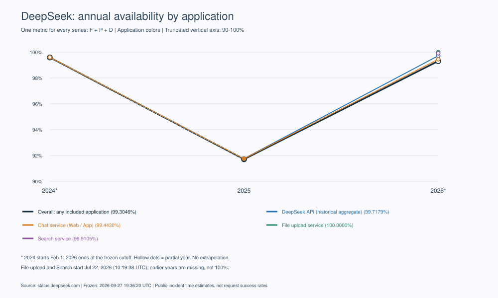
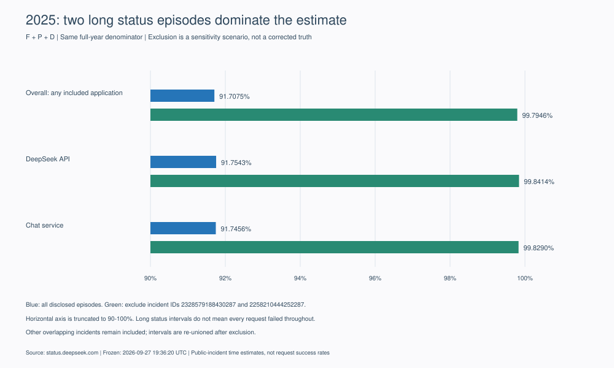

# DeepSeek 可用性与历史事故分析报告

**v1.0 · 冻结截止：2026-09-27 19:36:20 UTC · 基于 status.deepseek.com 公开历史**

## 年度可用性总结

按统一 **F∪P∪D** 口径，整体（任一纳入应用受影响）的时间可用性估计为：2024 年观察期 **99.5892% ***、2025 全年 **91.7075%**、2026 年截至冻结时刻 **99.3046% ***。2026 年 API 为 **99.7179% ***，对话服务为 **99.4430% ***；搜索为 **99.9105% ***。文件上传在较短观察期内没有可计量故障阶段，记录推导值为 **100%**，不能解释为实测完全可靠。

**2025 年的低值主要由两条多日状态公告驱动。** 排除这两条后重新对其余事故取并集，整体为 **99.7946%**，相差 **8.09 个百分点**。这是敏感性场景，不是把两条真实公告删除后的“正确答案”。2024、2026 均不是完整年度，不作年化或同周期改善推断。

| 整体／应用 | 2024 | 2025 | 2026 截止时刻 | 官方历史观察起点 UTC |
| --- | --- | --- | --- | --- |
| 整体（任一纳入应用受影响） | 99.5892% * | 91.7075% | 99.3046% * | 2024-02-01 00:00:00 |
| DeepSeek API（历史综合服务） | 99.5892% * | 91.7543% | 99.7179% * | 2024-02-01 00:00:00 |
| 对话服务（网页／APP） | 99.6014% * | 91.7456% | 99.4430% * | 2024-02-01 00:00:00 |
| 上传文件服务 | —（未进入观察期） | —（未进入观察期） | 100.0000% * | 2026-07-22 10:19:38 |
| 搜索服务 | —（未进入观察期） | —（未进入观察期） | 99.9105% * | 2026-07-22 10:19:38 |

* 2024：02-01 00:00:00 至 2025-01-01 00:00:00；2026：01-01 至 09-27 19:36:20。上传与搜索仅从 2026-07-22 10:19:38 开始。星号代表部分年度；缺失年份不填 0% 或 100%。API 合并当前两个 API 组件的历史序列，**不表示 V4 Pro／V4.1 Flash 在 2024 年已上线**。对话服务包含可识别的专家／识图模式子功能。

图 1｜整体及四个应用使用同一 F∪P∪D 口径。颜色区分应用而非故障等级，整体线加粗；纵轴截短至 90%—100%。虚线连接部分年度，空心点为部分年度，搜索和上传只显示 2026 单点。图例括号为最新观察值。[图表源数据](figures/annual-availability.csv) · [PNG](figures/annual-availability.png)

整体由全部纳入应用的影响时间**重新取并集**，不是产品可用性的平均值，也不表示所有产品同时故障。新增组件、观察期长短、公告粒度及状态时间代理均影响可比性。本报告是公开事故的时间可用性估计，**不是实际请求成功率、单用户体验、官方 uptime 或合同 SLA**。两起事故缺可信时长，未进入分子；其余时间不能全部视为已测量正常。

## 研究范围与历史覆盖

公司名称在官方页面确认为 DeepSeek；当前平台为 Flashduty。官方最早组件历史起点为 **2024-02-01 00:00:00 UTC**。本轮按月查询 2024-01-01 至冻结时刻，共 33 个连续窗口，另查 2023-01-01 至 2024-02-01 边界前范围，返回零记录。最早实际取得的首次更新是 **2024-05-10T08:30:00Z**；最早公告所记录的影响起点是 **2024-05-09T20:30:00Z**，属于回溯窗口。历史起点不是产品上线日期。

共取得 **105 条唯一记录：103 起事故、2 条维护，314 条更新**；全部取得详情并逐条审阅。覆盖状态为 **enumerated**：公开接口已按边界枚举，且 17 个重叠 History 页面数据的 ID 并集与 105 条接口记录一致；2025 年 1 月、2026 年 8 月再拆半月查询，ID 与整月一致。枚举完整不证明厂商披露了全部真实故障。一次连接重置后按已保存断点续取成功，现无失败窗口。

| 首次更新／公告代理年份 | 事故 | 维护 |
| --- | --- | --- |
| 2024 | 21 | 2 |
| 2025 | 27 | 0 |
| 2026 | 55 | 0 |

接口没有独立、可核实的创建时间字段，CSV 的 published_at_utc 使用最早更新作为公告时间代理，并保留质量标记。列表按事件窗口返回，跨窗口重复按 ID 去重；分子使用完整更新重建，因此保留显示 start_at 之前的影响阶段。年度时长按 UTC 年界裁切，不按公告日期直接归整段时长。

**History 页面有可复现的覆盖陷阱。** 2026-09 页面标题显示 7—9 月，但七月标成“一切运行正常”；切到 2026-07 页面可见七月 8 起事故，同页五月又显示正常。接口确认五月有 7 起。本文以按月接口和重叠页面核验，未把第三个月的空显示当成零事故。[九月 History](https://status.deepseek.com/history?month=2026-09) · [七月 History](https://status.deepseek.com/history?month=2026-07) · [覆盖核验记录](coverage.json)

## 方法、应用边界与数据质量

计算式为 A = 1 − 影响时间并集秒数 / 观察期秒数。每个服务仅贡献自身观察窗口内的区间，跨年裁切、并发去重，计划维护排除。维护期间仍留在日历分母中，因此这是排除维护影响的研究口径，不是维护也需扣分的 SLA 口径。报告同时计算 F、F∪P、F∪P∪D；未知时长不填零，也不凭空补齐。

F 表示定义范围完全不可用；P 表示部分用户、模型或功能不可用；D 表示性能或质量退化。先分析正文与范围，无法定级时，采用 Flashduty 自身图例和对应阶段原值：full_outage→F、partial_outage→P、degraded→D。官方模板“正在调查／已恢复”不构成语义定级证据。API 单个模型的 Full、专家或识图子功能的 Full，不升级成整个应用 Full；这些子集按 P 处理。组件同时 Full 的官方兜底也只代表统计标签，不证明所有用户所有请求失败。

| 事故定级来源 | 数量 | 含义 |
| --- | --- | --- |
| 仅分析定级 | 19 | 标题／正文明确影响对象，含缺时长的两条 |
| 分析与官方阶段兜底混合 | 31 | 只覆盖可判断的阶段，其余保留官方状态 |
| 仅官方阶段兜底 | 53 | 已阅读全文，语义仍不足 |
| 最终仍无法定级 | 0 | 不包括维护 |
| 明确无用户影响的事故 | 0 | 维护另列 |

有效最高等级按事故计：F **34**、P **37**、D **32**。最高等级只用于事故概览，计算仍使用每个服务、每个阶段。原分析等级和官方兜底标记分别保留。

**时间质量：** 98 起事故使用可定位的组件历史状态阶段，3 起采用标明的公告活动期代理，2 起只有结案且字段相差一秒，无法确认可信影响时长；未结案事故为 0。所有记录的 time_complete 均保守保留 False，因为状态变更与公告不能证明真实影响边界。Monitoring 不自动算恢复；正文明确恢复则结束影响；重开阶段单独计入。2026-09-23 的最新事件有恢复后再次退化阶段，已保留中间正常间隙。

**组件沿革：** 详情保留两种未命名旧组件 ID，以及隐藏的专家／识图组件。未命名旧 ID 不强行归产品；核对其时间并集，未发现超出现有具名组件的额外整体影响时间。当前 API 名称被回填进旧公告，故本报告采用综合 API 历史口径。搜索在 7 月 22 日成为独立观察组件之前的一起搜索故障仍归当时的对话服务，不回填新组件上线前的分母。仅出现在 affected_components、但历史状态一直为 operational 的上传组件，不当作受影响服务。

**根因披露：** 仅 2 起有供应商明确原因陈述：一条涉及恶意攻击与注册限制，一条涉及系统升级故障。其余已读事故未披露可确认根因；“已经找到原因”不等于公开了原因。本次检查全部详情、314 条正文及 5 个重点 HTML 详情页，未发现独立复盘字段或外部复盘链接；不据此声称不存在其他外部复盘。

## 2025 年：长公告的解释与敏感性

[2025-01-27 起的网页/API 异常](https://status.deepseek.com/incidents/2328579188430287)含多次 Full、Partial、Degraded 切换，最长持续至 2 月 8 日；正文说明恶意攻击、注册限制，也有后续范围不同的故障阶段。注册受限仅在对应有明确陈述的阶段按 P，不能把整条公告统一写成全站中断，也不能把后续所有阶段归因于攻击。

[2025-02-08 至 02-26 的优化／性能异常](https://status.deepseek.com/incidents/2258210444252287)仅两次更新，组件保持 degraded 约 **427.17 小时**。本报告保留官方记录，但它描述的是广义性能退化状态，不是连续约 18 天完全无法使用。

| 2025 整体场景 | F∪P∪D 影响并集小时 | 时间可用性 |
| --- | --- | --- |
| 全部公开阶段（主口径） | 726.42 | 91.7075% |
| 排除两条多日公告后重新取并集 | 17.99 | 99.7946% |
| 仅 F（主数据，不删除公告） | 56.16 | 99.3589% |

图 2｜相同全年分母下重算并集；排除场景保留同期其他事故，不直接从总时长减去两条公告。横轴截短至 90%—100%。两条公告在整体并集中独占约 **708.43 小时**，占主口径影响时间的 **97.52%**。[源数据](figures/sensitivity-2025.csv)

## 2026 年：API 与对话服务的差异

截至截止时刻，整体影响并集 **45.03 小时**；API 为 **18.27 小时**，对话服务为 **36.07 小时**。两者存在并发，不能将小时数相加当作整体故障时长。55 起公告比 2025 全年的 27 起更多，但不是等长观察窗口比较，且平台迁移、披露粒度和短事件记录都会影响数量。

| 应用／整体 | F 可用性 | F∪P 可用性 | F∪P∪D 可用性 | F∪P∪D 小时 |
| --- | --- | --- | --- | --- |
| 整体（任一纳入应用受影响） | 99.8184% | 99.5798% | 99.3046% | 45.029 |
| DeepSeek API（历史综合服务） | 99.9736% | 99.8337% | 99.7179% | 18.271 |
| 对话服务（网页／APP） | 99.8357% | 99.6760% | 99.4430% | 36.071 |
| 上传文件服务 | 100.0000% | 100.0000% | 100.0000% | 0.000 |
| 搜索服务 | 99.9959% | 99.9105% | 99.9105% | 1.448 |

上传服务的 100% 仅说明在 2026-07-22 起的较短公开观察期中没有记录到非正常阶段；搜索服务为独立组件后的记录结果，不能直接与全年 API 排名。对需要网页／APP 登录、历史记录、搜索等能力的用户，API 指标不能代表完整产品体验。

## 影响最大的事故与关键复核

| 官方事故（UTC 首次更新） | 标题 | 计算影响小时 | 主要质量说明 |
| --- | --- | --- | --- |
| [2025-02-08](https://status.deepseek.com/incidents/2258210444252287) | DeepSeek 网页/API 性能异常（DeepSeek Web/API Degraded Performance） | 427.170 | 多日状态公告 |
| [2025-01-27](https://status.deepseek.com/incidents/2328579188430287) | DeepSeek 网页/API 性能异常（DeepSeek Web/API Degraded Performance） | 281.257 | 多日状态公告 |
| [2024-11-27](https://status.deepseek.com/incidents/3173004118562287) | DeepSeek 网页/API不可用（DeepSeek Web/API Service Not Available） | 12.250 | 公告代理 |
| [2024-05-10](https://status.deepseek.com/incidents/4580379002115287) | 【已恢复】DeepSeek 网页对话服务与 API 不可用 ([Resolved] DeepSeek web chat service and API are unavailable) | 12.000 | 公告代理 |
| [2026-03-29](https://status.deepseek.com/incidents/498991839811287) | 【已解决】DeepSeek 网页/APP 性能异常（[Resolved]DeepSeek Web/APP Service Performance Agnormal） | 10.221 | 按阶段／应用去重 |
| [2026-07-22](https://status.deepseek.com/incidents/6741259174287) | DeepSeek 网页端搜索不可用（DeepSeek Web Search Service Unavailable） | 3.879 | 按阶段／应用去重 |
| [2026-04-20](https://status.deepseek.com/incidents/287885607278287) | 【已解决】DeepSeek Web/APP 快速模式性能异常（[Resolved]DeepSeek Web/APP Instant Mode Performance Abnormal） | 3.474 | 按阶段／应用去重 |
| [2025-01-27](https://status.deepseek.com/incidents/2539685420963287) | DeepSeek API不可用（DeepSeek API Service Not Available） | 3.435 | 按阶段／应用去重 |
| [2026-09-14](https://status.deepseek.com/incidents/7010698581287) | DeepSeek 网页/API 部分中断（DeepSeek Web/API Partially Unavailable） | 3.000 | 按阶段／应用去重 |
| [2025-07-30](https://status.deepseek.com/incidents/1695260490831287) | 【已恢复】DeepSeek 网页/API性能下降（[Resolved] DeepSeek Web/API Performance Degradation） | 2.313 | 按阶段／应用去重 |

[2026-08-04 的 API 性能下降](https://status.deepseek.com/incidents/6800501267287)在 History 显示约 2 天，但首次组件恢复发生于开始后 **826 秒（13 分 46 秒）**；之后两次 resolved 更新不续长故障。[2025-05-13 网页／APP 故障](https://status.deepseek.com/incidents/1976735467542287)在正文宣布对话恢复后仍有登录和历史读取问题，故由 F 转 P；正文宣布全部恢复后结束影响，覆盖仍残留的红色状态。[2025-01-27 账号故障](https://status.deepseek.com/incidents/2398947932608287)则相反：对话组件变绿时账号仍不可用，保留登录／注册受影响时间。

两条缺时长记录分别为 [2024-07-24 Chat Web/API 不可用](https://status.deepseek.com/incidents/4087797792872287)、[2024-08-12 Coder Web/API 不可用](https://status.deepseek.com/incidents/3665585327806287)，均只有结案更新且 start/close 相差一秒。本文不以一秒冒充真实影响。2024 年主口径含三条公告代理；剔除或重估这些记录会改变结果，因此不能凭高精度百分比推断测量同样精确。

## 使用结论与交付核验

用于服务选型时，优先关注所依赖应用和失败类型：2026 年公开记录中，对话应用受影响时间高于综合 API；2025 年总体低值必须结合长时间降级公告阅读。状态页适合定位已披露事故与恢复过程；要评估具体工作负载，应另结合调用成功率、延迟分位数、地区和模型维度的实际观测。本报告未开展实时探测。

CSV 已按 incident-csv-v1 的 **48 列固定顺序、UTF-8 BOM** 导出并用 CSV 解析器复读。核验 ID 唯一、105 行、JSON 可解析、原始对象规范化 SHA-256、完整更新无截断、引文存在、UTC 时间、正长度阶段、截止边界、并集时长及分级单调关系。199 个带请求元数据的 HTTP 响应文件哈希已核对；语义审阅、结构核验与覆盖检查分别记录，不混为实测可用性证明。

- [主交付 incidents.csv](incidents.csv)：公告、全部更新、原始对象、分析与阶段证据均在单文件中。
- [年度数据](annual-data.csv) · [计算数据 trend_data.json](trend_data.json) · [观察窗口](service_windows.json)。
- [逐事故审阅](analysis.json) · [结构验证](validation.json) · [覆盖验证](coverage.json)。
- [原始证据目录](raw/) · [复算脚本目录](tools/) · [完整研究资料 ZIP](DeepSeek_Availability_Audit_2026-09-27_v1.0.zip)。

CSV SHA-256：`b1ba8e7733915056c497045a99ef0269e114ed5ae70d18e32fd33c71c1c09191`

公开原始来源：[DeepSeek 状态首页](https://status.deepseek.com/) · [History](https://status.deepseek.com/history) · [当前公开组件摘要](https://status.deepseek.com/api/status-page/6410630422455/summary/active)。正文事故标题链接指向对应官方详情；原始请求地址与获取时间逐文件保存在 raw/*.meta.json。本报告与公开证据作为本仓库研究资料归档；临时 Cookie 响应头已去除，原始响应 body 字节保持不变。
