# OpenAI 服务可靠性与历史事故分析报告

**APIs · ChatGPT · Codex · Overall｜年度对比、三种可用性口径与事故证据**

报告日期：**2026 年 9 月 27 日** · 版本：**v1.1，年度趋势增强／公开记录重分类估计版**。

数据截止：**2026-09-26 22:51:22 UTC**，即 **2026-09-27 00:51:22，德国夏令时（Europe/Berlin）**。分析总窗口从 2021-02-01 开始。文件名中的 9 月 27 日不是整日覆盖声明；本报告使用 CSV 内嵌的统一抓取时间，未把随后实时网页的新增数据并入统计。

> **先读这一点：下文“可用性”均为公开事故记录对应的未受影响时间占比，是估计指标，不是 OpenAI 官方 uptime、合同 SLA、请求成功率或某位用户的真实可用率。** 分组内任意被纳入的组件发生相应等级的故障，就进入该组的受影响时间并集。24 起事故不能定位完整时间区间；公告代理区间也可能长于或短于实际影响。所有百分比必须连同这些限制使用。

> **v1.1 更新（2026-09-27）：**新增／升级 9 张年度与同期趋势图。原始 CSV、事故判级、年度总表与冻结截止时间不变。HTML 为单文件内嵌图表；Markdown 的配图位于复算包内同名 `OpenAI_Reliability_Trends_2026-09-27` 文件夹。

## 一、执行摘要

本次已实际读取并校验完整 CSV：**1,007 条唯一记录，其中 1,006 起事故、1 条计划维护，合计 3,612 条更新**。计划维护不计入事故次数或故障时长。与此前对话中“完整文件尚未生成”的说法不同，完整输入在本次分析时已找到并验证；原始文件保持不变。来源及复算文件见文末 D1–D4。

**最重要的结论不是一个孤立的“几个九”，而是口径差异。** 重分类后，全期 Overall 的仅 Full 指标为 **99.8096%**；纳入 Partial 后为 **97.7321%**；再纳入功能和性能降级，为 **89.8284%**。后一个数值表示“所有已纳入功能均未处于已公告影响状态”的时间占比，不能理解为 OpenAI 在其余时间全部停机。

**2026 年的事故公告数量没有比去年同期明显增加。** 按同样的 1 月 1 日至 9 月 26 日 22:51:22 UTC 窗口，以公告时间计数，2025 年有 **256 起**，2026 年有 **255 起**，减少 1 起，约 **0.4%**。2025 全年较 2024 全年从 187 起增至 339 起、增幅约 81.3%，但服务范围扩大、组件细分和披露习惯变化都可能影响数量，不能仅凭次数断定底层系统按同样比例恶化。

**ChatGPT 与 Codex 的“Full”不等于整个产品完全瘫痪。** 2026 年 ChatGPT 组的已定位 Full 共约 **25 分 05 秒**，包含 Shopping Research 和 Voice 的组件级中断，并不是文字聊天对所有用户的停机总时长。Codex 9 月 25 日事故中，API key 替代路径出现前后应区别讨论，不能把整个红色事故生命周期都理解为所有访问方式全部失效。

**公开复盘呈现的反复风险，集中在变更、资源限制和服务依赖。** 可提取的复盘共有 76 份，仅覆盖事故数的约 7.6%；其中 25 份仅存在于结构化文本节点。它们足以支持具体机制分析，但不足以给全部 1,006 起事故作准确的根因占比排名。

## 二、全期结果：四组、三种口径

下表为**重分类估计主结果**，不是未经解释的原始红黄绿累计值。

| 服务组 | 事故数 | Full 条 | Partial 条 | Degraded 条 | Full 小时 | Partial 小时¹ | Degraded 小时¹ | 仅 Full 可用性² | Full+Partial 可用性² | 全部等级可用性² | 区间不明 条 |
| --- | --- | --- | --- | --- | --- | --- | --- | --- | --- | --- | --- |
| Overall | 1006 | 91 | 361 | 554 | 94.34 | 1,029.07 | 3,915.07 | 99.8096% | 97.7321% | 89.8284% | 24 |
| APIs | 468 | 45 | 182 | 241 | 50.18 | 409.87 | 1,186.65 | 99.8987% | 99.0713% | 96.6757% | 19 |
| ChatGPT | 565 | 38 | 190 | 337 | 33.68 | 648.55 | 2,024.84 | 99.8995% | 97.9651% | 91.9257% | 5 |
| Codex | 90 | 3 | 35 | 52 | 2.15 | 110.82 | 220.14 | 99.9820% | 99.0566% | 97.2183% | 0 |

¹ Partial 小时是剔除同期 Full 后的独占时间；Degraded 小时是剔除同期 Full 和 Partial 后的独占时间。三列相加等于该组全部等级受影响时间，同一时刻不会重复累计。

² 三个指标的公式分别为 `1 − Full并集/T`、`1 − (Full∪Partial)并集/T`、`1 − (Full∪Partial∪Degraded)并集/T`。四位小数用于复算对照，不表示真实影响时间具有这样的测量精度。

事故数按每条记录的最高等级互斥归类；时长则按阶段归类。因此，一起最高为 Full 的事故，仍可以包含恢复过程中的 Partial 或 Degraded 时间。同一事故可同时归属多个产品，三产品次数不能相加当作 Overall。

### 2.1 分母与服务边界

| 服务组 | 分析起点（UTC，日期级） | 截止时累计窗口（天） | 实际含义 |
| --- | --- | --- | --- |
| Overall | 2021-02-01 | 2,063.95 | 所有公开服务及未映射记录的时间并集，不是三产品相加 |
| APIs | 2021-02-01 | 2,063.95 | 开发者服务组，含推理、文件、微调、Playground、登录及部分管理功能 |
| ChatGPT | 2022-11-30 | 1,396.95 | ChatGPT 功能组，含聊天、语音、研究、连接器和部分企业功能 |
| Codex | 2025-05-16 | 498.95 | 以现代云端 Codex 为可比窗口，含按组件映射纳入的 Web、CLI、VS Code extension、Codex API |

ChatGPT 起点参考公开发布日（S2）；Codex 起点参考现代云端产品发布日（S3），并**不意味着早期 Codex 模型或 CLI 也在这天首次发布**。API 和 Overall 的起点是本批次数据覆盖约定，而不是 API 产品的最初上线时间。不同产品存续窗口不同，不宜按全期百分比直接排“谁更稳定”。

仅官网营销或定价页面异常归入 Other，并进入 Overall；不自动算作聊天或推理接口故障。Sora 独立服务、FedRAMP、广告平台和其他无法映射的服务也可进入 Overall。当前组件树中 Codex in ChatGPT Desktop 属于 ChatGPT；独立 Codex API 属于 Codex。分类选择在附件中保留。

## 三、2026 年同期快照

以下四组共享 2026 年同一截止时刻，更适合比较**口径差异**，但各组内部功能覆盖仍不同。

| 服务组 | 事故数 | Full 条 | Partial 条 | Degraded 条 | Full 小时 | Partial 小时¹ | Degraded 小时¹ | 仅 Full 可用性² | Full+Partial 可用性² | 全部等级可用性² | 区间不明 条 |
| --- | --- | --- | --- | --- | --- | --- | --- | --- | --- | --- | --- |
| Overall | 255 | 6 | 76 | 173 | 3.83 | 218.59 | 1,236.80 | 99.9406% | 96.5543% | 77.3935% | 3 |
| APIs | 66 | 1 | 18 | 47 | 0.48 | 27.31 | 139.02 | 99.9926% | 99.5696% | 97.4159% | 2 |
| ChatGPT | 176 | 2 | 54 | 120 | 0.42 | 167.02 | 608.00 | 99.9935% | 97.4059% | 87.9866% | 1 |
| Codex | 55 | 1 | 20 | 34 | 0.34 | 55.20 | 126.19 | 99.9947% | 99.1395% | 97.1846% | 0 |

2026 年 APIs、ChatGPT、Codex 的仅 Full 指标都高于 99.99%，但这**不是三种产品都达到“4 个 9”真实 SLA 的证据**。它只说明在本次分类、已知区间和广义产品分组下，已定位的 Full 时间较少。局部用户失败、特定功能不可用以及尚未精确定位的事故仍然存在。

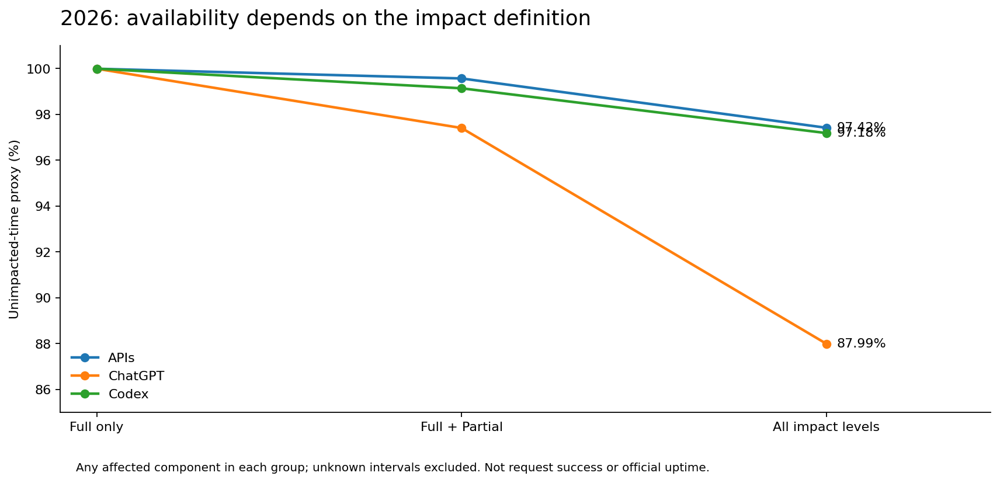

### 3.1 为什么全部等级指标会显著下降

该口径把“任意已纳入功能受影响”的完整区间计入并集，**不按受影响用户比例或流量权重折算**。例如某地区、某企业功能连续数天异常，即使多数用户可以正常聊天，也会影响这项指标。它是严格的“功能全绿时间”观察值，更适合发现长尾产品质量问题，而不是估计用户有多大概率得到回答。

公开数据中存在耗时很长但影响范围受限的记录，包括新用户视频创建限制、FedRAMP 部分工作区功能问题、地区性 Deep Research 错误，以及账单或企业数据展示延迟。把这些记录解释成整个 OpenAI 或 ChatGPT 长时间不可用，是错误的。

## 四、年度趋势与完整对照表

**图表口径：**沿用 v1.0 的冻结结果。空心点表示非完整年，末段虚线为 2026 年内快照；缺少年份留空，不填成零或 100%。2021 从 2 月起；ChatGPT 2022 年仅 32 天，Codex 2025 年仅 230 天。每 30 天标准化不消除季节性，也不是全年预测。三种可用性图的纵轴分别局部放大，应比较标注数值，而不是不同图上的垂直距离。

### 4.1 年度事故数量与标准化频次

完整年度与年内快照分开看：2025 年整体为 339 起，是已观测完整年度的最高值；2026 年当前 255 起不宜直接与之计算全年同比。每 30 天视图用于检查观察期长度的影响。

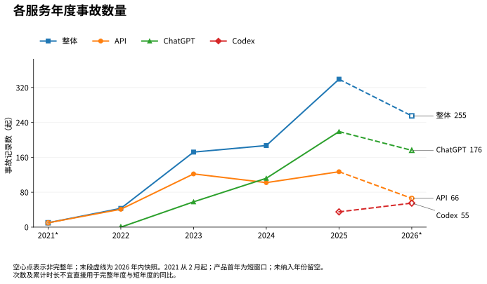

**图 1：各服务年度事故数量。** 四条曲线分别为 API、ChatGPT、Codex 和整体，保留原表年度计数。2025→2026 的末段虚线只连接实际快照，不代表已完成全年同比。

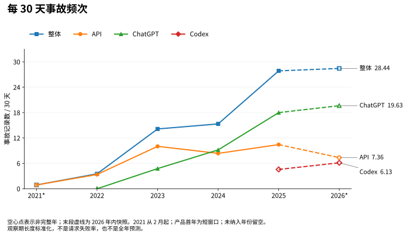

**图 2：每 30 天事故频次。** 计算为年度事故数 ÷ 该服务当年观察天数 × 30。这里只校正观察期长度，未消除季节性、产品范围和披露习惯变化；不是请求失败率，也不预测全年。

### 4.2 年度影响时长：三种累计口径

次数与时长不必同向：一次长时间的局部功能异常可能比多次短中断占用更多“全部等级”影响小时。比较不同年份时，应同时读下一组可用性曲线及同期窗口。

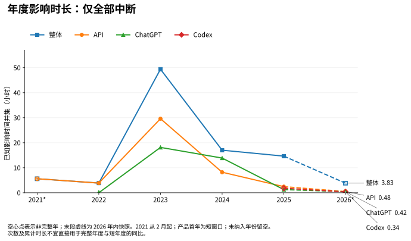

**图 3：年度影响时长：仅全部中断。** 仅累计 Full 阶段的时间并集。Full 可能仅针对一个被纳入的组件，不等于整个服务组全面不可用。

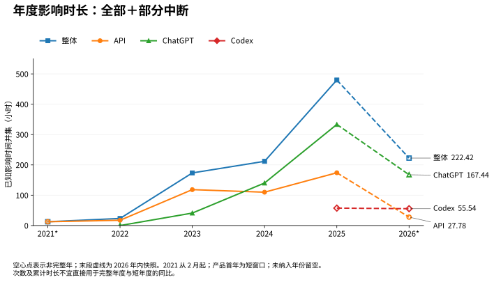

**图 4：年度影响时长：全部＋部分中断。** 累计 Full∪Partial 的时间并集，而不是把两类独立累计时长直接相加。整体对所有服务再去重；2026 是未满年的累计值。

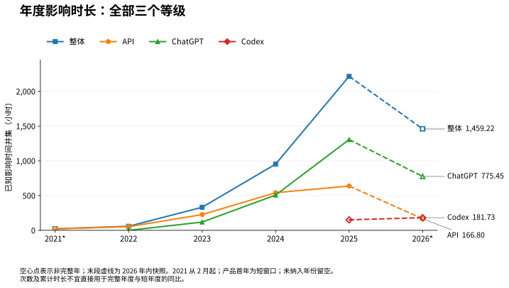

**图 5：年度影响时长：全部三个等级。** 累计 Full∪Partial∪Degraded。局部功能持续异常也会进入该口径；图中小时数不等于整个产品的宕机小时数。24 起区间不明事故不加入时长。

### 4.3 年度可用性：三种扣除口径

三种口径对应不同问题：2023—2025 完整年度中，整体仅 Full 指标由 99.4361% 升至 99.8329%，但全部等级指标由 96.2135% 降至 74.7118%。这说明已记录的影响结构发生变化，不能简化为一个“更稳定／更不稳定”的结论。

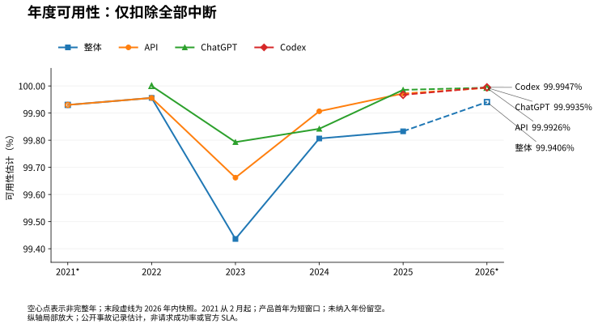

**图 6：年度可用性：仅扣除全部中断。** A₁ = 1 − U_F / T。曲线向上表示已知 Full 影响占观察期的比例下降；纵轴局部放大，不能据此宣称达到真实 SLA。

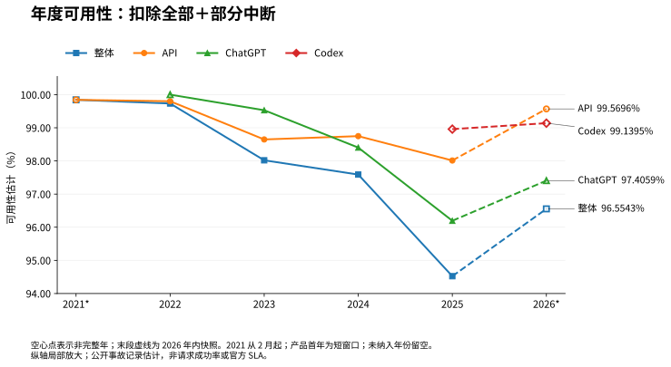

**图 7：年度可用性：扣除全部＋部分中断。** A₂ = 1 − U_FP / T。纵轴局部放大。它比只看 Full 更能展示局部访问失败；与其他口径对比时，应读百分比而不是图上的垂直距离。

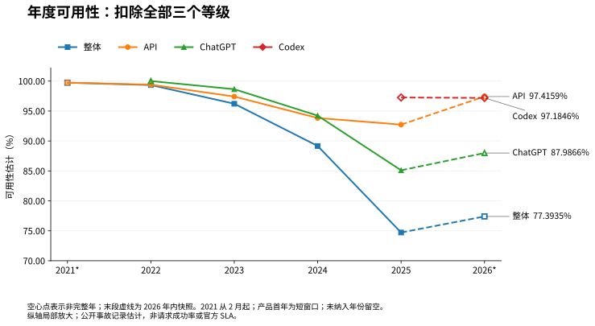

**图 8：年度可用性：扣除全部三个等级。** A₃ = 1 − U_ALL / T。曲线向下可能来自长期局部功能或数据质量问题，并不说明所有用户同样比例的请求失败。2022 年 ChatGPT 的 100% 仅对应原数据中 32 天的短窗口。

### 4.4 同期可比窗口：2025 与 2026

同期趋势分化：整体公告数几乎持平，API 减少、ChatGPT 略增、Codex 增加。进一步比较相同窗口，整体 Full+Partial 指标从 96.7692% 降至 96.5543%，而全部等级指标从 74.7185% 升至 77.3935%；次数、严重访问影响和长尾降级也并不一致。

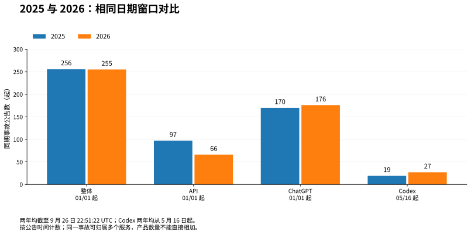

**图 9：2025 与 2026：相同日期窗口对比。** 整体、API、ChatGPT 均比较 1 月 1 日至 9 月 26 日；Codex 两年均比较 5 月 16 日至 9 月 26 日。截止时分秒相同，按事故公告时间计数。

| 服务组 | 两年共同日期窗口 | 2025 次数 | 2026 次数 | 增减 | 同比 |
|---|---|---:|---:|---:|---:|
| 整体（Overall） | 01/01–09/26 | 256 | 255 | -1 | -0.4% |
| API | 01/01–09/26 | 97 | 66 | -31 | -32.0% |
| ChatGPT | 01/01–09/26 | 170 | 176 | +6 | +3.5% |
| Codex | 05/16–09/26 | 19 | 27 | +8 | +42.1% |

上述同期次数按公告时间统计，与下面原表的“首次可定位影响年”计数口径区分。同期时长对所有与窗口相交的阶段取并集；未知区间不扣时长。新增完整底表见 `annual_trend_data.csv` 和 `matched_window_trend_data.csv`。

### 4.5 年度完整对照表（原统计数值不变）


主表中事故按**首次可定位影响时间的年份**归属；缺少时间则用公告年份。跨年影响按各年的实际重叠时间分摊。2026 年带星号的行均为年初至快照，不能与完整年度直接比较。下表所有年份均已排除计划维护。

| 年度 | 服务组 | 事故数 | Full 条 | Partial 条 | Degraded 条 | Full 小时 | Partial 小时¹ | Degraded 小时¹ | 仅 Full 可用性² | Full+Partial 可用性² | 全部等级可用性² | 区间不明 条 |
| --- | --- | --- | --- | --- | --- | --- | --- | --- | --- | --- | --- | --- |
| 2021 | Overall | 10 | 5 | 2 | 3 | 5.60 | 6.93 | 9.00 | 99.9302% | 99.8437% | 99.7314% | 2 |
| 2021 | APIs | 10 | 5 | 2 | 3 | 5.60 | 6.93 | 9.00 | 99.9302% | 99.8437% | 99.7314% | 2 |
| 2021 | ChatGPT | — | — | — | — | — | — | — | — | — | — | — |
| 2021 | Codex | — | — | — | — | — | — | — | — | — | — | — |
| 2022 | Overall | 43 | 7 | 21 | 15 | 3.86 | 19.50 | 35.12 | 99.9559% | 99.7332% | 99.3323% | 2 |
| 2022 | APIs | 41 | 7 | 19 | 15 | 3.86 | 13.53 | 35.12 | 99.9559% | 99.8014% | 99.4005% | 2 |
| 2022 | ChatGPT | 0 | 0 | 0 | 0 | 0.00 | 0.00 | 0.00 | 100.0000% | 100.0000% | 100.0000% | 0 |
| 2022 | Codex | — | — | — | — | — | — | — | — | — | — | — |
| 2023 | Overall | 172 | 41 | 73 | 58 | 49.39 | 124.11 | 158.19 | 99.4361% | 98.0193% | 96.2135% | 9 |
| 2023 | APIs | 122 | 18 | 57 | 47 | 29.60 | 88.78 | 108.34 | 99.6620% | 98.6485% | 97.4118% | 8 |
| 2023 | ChatGPT | 58 | 20 | 19 | 19 | 18.13 | 23.04 | 77.86 | 99.7931% | 99.5301% | 98.6413% | 0 |
| 2023 | Codex | — | — | — | — | — | — | — | — | — | — | — |
| 2024 | Overall | 187 | 18 | 94 | 75 | 17.01 | 194.76 | 740.53 | 99.8064% | 97.5891% | 89.1586% | 2 |
| 2024 | APIs | 102 | 10 | 48 | 44 | 8.20 | 101.72 | 431.88 | 99.9067% | 98.7486% | 93.8320% | 2 |
| 2024 | ChatGPT | 112 | 12 | 56 | 44 | 13.87 | 126.41 | 367.22 | 99.8421% | 98.4030% | 94.2225% | 0 |
| 2024 | Codex | — | — | — | — | — | — | — | — | — | — | — |
| 2025 | Overall | 339 | 14 | 95 | 230 | 14.64 | 465.16 | 1,735.44 | 99.8329% | 94.5228% | 74.7118% | 6 |
| 2025 | APIs | 127 | 4 | 38 | 85 | 2.44 | 171.60 | 463.29 | 99.9722% | 98.0133% | 92.7246% | 3 |
| 2025 | ChatGPT | 219 | 4 | 61 | 154 | 1.27 | 332.08 | 971.76 | 99.9855% | 96.1947% | 85.1016% | 4 |
| 2025 | Codex | 35 | 2 | 15 | 18 | 1.81 | 55.62 | 93.95 | 99.9672% | 98.9597% | 97.2576% | 0 |
| 2026* | Overall | 255 | 6 | 76 | 173 | 3.83 | 218.59 | 1,236.80 | 99.9406% | 96.5543% | 77.3935% | 3 |
| 2026* | APIs | 66 | 1 | 18 | 47 | 0.48 | 27.31 | 139.02 | 99.9926% | 99.5696% | 97.4159% | 2 |
| 2026* | ChatGPT | 176 | 2 | 54 | 120 | 0.42 | 167.02 | 608.00 | 99.9935% | 97.4059% | 87.9866% | 1 |
| 2026* | Codex | 55 | 1 | 20 | 34 | 0.34 | 55.20 | 126.19 | 99.9947% | 99.1395% | 97.1846% | 0 |

服务推出前显示“—”，而不是 100%。2022 年 ChatGPT 仅覆盖 11 月 30 日起的短窗口；0 条事故及 100% 表示**该输入没有记录到纳入本口径的影响**，不是对真实零故障的验证。2021 年从 2 月 1 日开始；2023 年的原始 173 条状态记录中，1 条是维护，因此本表列 172 起事故。

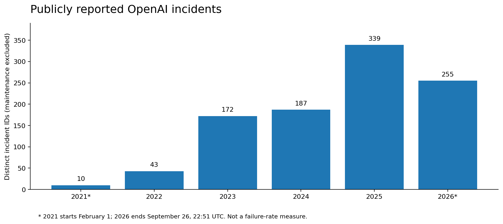

2025 年是本数据中完整自然年的公告记录数峰值。2026 年尚未结束；更稳妥的说法是“截至同一时间点，事故记录总数与 2025 年同期基本持平”，而不是将 255 直接与 339 比较后宣称全年减少约四分之一。


## 五、官方等级参考与重分类结果的差别

为防止把推断伪装成官方结论，本报告同时保留一套**官方等级参考复算**：尽量使用官方的非正常组件阶段；缺少组件区间时，仅在可以归属的情形下使用状态摘要，并阻止复盘发布时间延长已结束的故障。该参考版也由本报告计算，**仍不等于 OpenAI 官网显示的 uptime**。

| 服务组 | 事故数 | 最高等级 F / P / D / 未分级 | Full 小时 | 仅 Full 可用性 | Full+Partial 可用性 | 全部等级可用性 |
| --- | --- | --- | --- | --- | --- | --- |
| Overall | 1006 | 82 / 205 / 577 / 142 | 90.51 | 99.8173% | 98.8393% | 91.1412% |
| APIs | 377 | 35 / 111 / 231 / 0 | 37.19 | 99.9249% | 99.4848% | 97.8416% |
| ChatGPT | 527 | 44 / 108 / 375 / 0 | 42.87 | 99.8721% | 98.9282% | 92.3528% |
| Codex | 81 | 3 / 16 / 62 / 0 | 2.74 | 99.9771% | 99.5834% | 97.4512% |

重分类主结果与参考版不只是数值舍入不同，而包含三类改动。第一，142 起原本没有官方等级的事故依据正文补判：18 起 Full、97 起 Partial、27 起 Degraded；另有 1 条无等级记录是维护。第二，67 起原本已有等级的事故，其全事件最高等级在分析中调整。第三，113 项专项校正涉及时间、分组或分类，其中 90 项提供明确阶段窗口；无法合理定位时间的记录保留为未知。

这是一套**全量规则筛查加重点证据校正**的结果，而非对 1,006 起事故进行独立人工审计后的官方定稿。已有等级遇到“elevated errors”这类泛化表述时，并不一律改成 Partial；缺乏更具体证据的阶段保留官方分类。事故审计表的 `classification_basis`、`time_qualities` 与 `review_note` 可区分直接证据、官方原值、正文推断及较弱标题推断。

两套结果的产品事故数也可能不同：重分类版补入了正文明确说明、但官方组件缺失的服务归属，同时纠正了正常组件被带入受影响列表的记录。因此，不应把两列差值都归因于“官方少报”或“人为调级”。

## 六、统计方法与判定边界

### 6.1 严重程度：描述优先，但不越过证据

**Full** 指正文明确完整中断、全部相关请求失败，或指定组件完全不可用；若正文信息不足，可保留官方 Full 阶段。这里的对象可能只是某个模型、Voice 或研究功能，**不能外推成整个服务组的所有功能全部宕机**。

**Partial** 指明确限于部分用户、地区、工作区、请求或访问路径的失败，或有量化证据显示只有部分流量失败。替代访问路径恢复是降为 Partial 的可讨论依据，但属于分析判断，不能冒充官方重新定级。

**Degraded** 指性能、延迟、输出质量、显示、计费或数据质量等降级；泛化错误描述在证据不足时可沿用官方 Degraded。三者不是按新闻标题的情绪强度分类，也不是按故障是否“很严重”主观投票。

证据优先顺序为：**明确的实际影响描述及复盘时间线 → 官方阶段与组件等级 → 标题推断**。有冲突就保留修订说明；没有足够时间证据就不构造精确区间。

### 6.2 时间：实际影响、状态维护、公告生命周期不能混为一谈

明确的实际影响窗口优先；其次采用结构化组件起止区间。仍缺少信息时，公告中的调查开始到首次 resolved 可作为代理时间，重开事故则重新分段。**Monitoring 本身不等于已经完全恢复**；另一次标为 resolved 的复盘发布，也不能延长已结束的故障。

所有时间统一转为 UTC，截取到产品分析起点与冻结截止时刻。以左闭右开的区间计算，跨年边界分别裁切；闰年按真实秒数处理。部分正文只给当地时分，涉及 8 起记录的时区解释已标为推断，不能视为秒级测量。

### 6.3 时间并集与三个公式

令 `T` 为某服务组在该年或全期的有效分析窗口秒数，`U_F` 为 Full 区间的并集秒数，`U_FP` 为 Full 和 Partial 的并集秒数，`U_ALL` 为全部三个等级的并集秒数：

```text
仅 Full 可用性       = 1 − U_F / T
Full + Partial 可用性 = 1 − U_FP / T
全部等级可用性       = 1 − U_ALL / T

Full 独占小时        = U_F / 3600
Partial 独占小时     = (U_FP − U_F) / 3600
Degraded 独占小时    = (U_ALL − U_FP) / 3600
```

同一事故同时影响多个组件，不重复累计；不同事故时间重叠也不重复累计。某时刻同时发生 Full 和 Partial，只计入 Full 的独占时长。Overall 对所有服务再取一次并集，绝不是把每个产品的小时数相加。

**ID 去重不等于根因去重。** 官网可能把同一个基础设施问题拆成多条产品事故；本报告仍保留这些公开记录的 ID 次数，以便与源文件核对，时间则通过并集避免重算。因此“1,006 起”准确地说是 1,006 条事故记录，不一定代表 1,006 个完全独立的物理根因。

## 七、典型事故：哪些技术细节真正改变结论

### 7.1 2026-09-25 Codex：红色时间不等于所有路径都不可用

[官方事故记录](https://status.openai.com/incidents/01M3DCNWMW57HYK8FJ5FBFPA39) 的官方结构化 Full 窗口为 **22:58:48.603–23:54:41.792 UTC**，共约 **55 分 53 秒**。德国当地已经是 9 月 26 日。

但 **23:19:11.698 UTC** 的更新明确说明，使用 API key 登录可以解除访问阻塞。本报告将之前约 **20 分 23 秒**保留为 Full，之后约 **35 分 30 秒**按替代访问路径可用、其他路径仍受限理解为 Partial。23:45 的监测阶段并未被直接当成完全恢复。

**这项分段是本报告的推断，不是官方改判。** API key 对某些用户并不一定可用，因此它也不表示普通账号登录已经恢复。官方公开说明未给出足够底层细节，不能据此编造 GPU、数据库或某一认证组件是确定根因。

### 7.2 2024-12-04：两轮故障，对 API 与聊天的影响不同

[官方事故记录](https://status.openai.com/incidents/01JMYB4A62XNXSAHAY8ZGQAAKD/write-up) 给出了两轮不同影响。第一轮 **15:48–15:52，太平洋时间**，API 请求出现 100% 的 530 错误，因此记为约 4 分钟 Full。第二轮 **16:07–17:37**，API 约 45% 的请求出现 499 错误，适合 Partial；ChatGPT 则出现约 30 秒等待后仍能完成的情况，适合 Degraded。

若只看事故标题，把两轮合并为 1 小时 49 分钟的全站完全中断，就同时错了时间范围和严重程度。这个案例说明，应当**按产品、按阶段、按实际失败方式**拆分，而不是给整条事故统一套上最高等级。

### 7.3 2024-12-11：遥测系统可以成为控制面故障源

[官方事故记录](https://status.openai.com/incidents/01JMYB483C404VMPCW726E8MET/write-up) 描述了一次遥测部署带来的级联故障：大量节点产生的控制面请求增加了 Kubernetes API 负载，控制面与 DNS 等依赖受压，进而影响多个服务。实际影响的总时间线为 **15:16–19:38，太平洋时间**；ChatGPT 与 API 的恢复时刻并不相同。

本报告不把这段 4 小时 22 分钟全部改判为 Full，而是在证据能支持的范围内保留不同阶段。工程上的启示是：**业务工作负载之外，遥测、服务发现和控制面依赖也可能放大故障**。仅证明单个组件在测试中工作正常，并不等于能证明它在全规模请求下不会使共享控制面失效。

### 7.4 2026 年 API 审计日志：不掉线，也可能发生严重服务质量问题

[官方事故记录](https://status.openai.com/incidents/01KJXA4N2X4W8KHZFSSFH0V0Q7/write-up) 说明，2025 年 11 月一次服务迁移遗漏了 Kafka 相关环境配置，导致部分 API Platform 审计事件未正常记录。修复发生在 **2026-02-19 19:04，太平洋时间**，而不是故障首次出现的时间；部分历史字段无法完整恢复。

该事故在本报告归入 API 的数据质量降级，**纳入事故数，但不把“2025 年 11 月某日”臆造成确切起点**，因此不加到精确时间并集。只看红色停机，这类事故可能完全不可见，但它对追溯和审计工作流的影响不能忽视。

### 7.5 长尾功能异常：为何“全部等级”不能当作核心推理宕机

2024 年一条 API 账单和使用量展示记录的可定位窗口约 **217.67 小时**，同时明确核心 API 不受影响；2025 年新用户视频创建限制的公告窗口约 **509.09 小时**；2026 年又有地区性 Deep Research 和部分 FedRAMP 功能持续异常。这些窗口可进入广义功能状态分析，却不能作为核心推理、所有文字聊天或所有客户不可用的证据。

同样，2026 年 ChatGPT 的 Full 已知时间中，Shopping Research 约 **23 分 38 秒**、Voice 约 **1 分 27 秒**。一条语音组件中断被计入 ChatGPT 组，与“所有聊天请求都失败”是两回事。

## 八、复盘主题与系统性启示

下表只是对 **76 份公开复盘记录**做可复算的关键词初筛。标签可以重叠，可能出现在原因描述，也可能出现在处置或改进措施中；同一根因还可能被多个事故复用。**这些百分比不是全部事故的主因占比，也不是独立事故的因果统计。**

| 复盘主题提及 | 涉及复盘记录数 | 占 76 份复盘记录 |
| --- | --- | --- |
| 变更/配置/发布 | 50 | 65.8% |
| 容量/负载/资源 | 48 | 63.2% |
| 观测/告警/发现 | 45 | 59.2% |
| 网络/DNS/路由 | 29 | 38.2% |
| 数据库/缓存/队列 | 28 | 36.8% |
| 认证/权限 | 25 | 32.9% |
| 第三方/云基础设施 | 21 | 27.6% |

结合具体复盘而非关键词本身，可以提出三个工程判断。

**变更风险需要按全规模依赖验证。** 监控、路由、网络插件、数据库迁移或功能开关都可能影响共享服务；发布成功并不等于用户路径成功。相应防护应围绕端到端成功率、分批放量、快速回滚和异构环境覆盖，而不是仅检查进程存活。

**恢复速度不仅取决于定位速度，也取决于可恢复容量。** 一些复盘说明，网络恢复后仍需重新部署模型、补足工作节点或解除数据库连接限制。故障诊断完成和业务容量恢复，应分开记录；重试风暴和积压队列也可能使恢复变慢。

**可用性、任务完成率和数据完整性应并列观察。** 单次 HTTP 请求成功，不保证长任务完成；任务完成，也不保证日志、计费、附件和历史记录正确。对于你的 Codex 工作流，账号登录、API key 替代路径、CLI / VS Code 扩展、任务进度及产物保存，适合分别记录，而不是只盯官网的一个全局色块。

以上是基于公开案例的工程分析，不代表已验证 OpenAI 当前每一个内部实现，也不构成对某项故障必然再次出现的预测。


## 九、数据质量、未知项与可使用的结论

### 9.1 本次完成了哪些核验

完整输入经 CSV 解析得到 1,007 个唯一事件 ID，所有 26 个字段保留；并未使用此前的 93 条部分文件替代全量数据。共提取 76 份复盘，包含 25 份没有 markdown、但可从结构化文本节点恢复正文的记录。

原始记录中，**143 条缺少官方等级**（其中 1 条是维护），**182 条缺少组件影响区间**。这两个集合有交叉，不能相加当作缺失记录数。缺少组件区间并不意味着完全没有可用证据，正文、状态摘要和更新记录可提供部分补充。

另外，有 **18 条记录的便利分组需要校正**：受影响组件列表中混入了状态为 operational 的条目。它们包括 17 起事故及 1 条维护。过滤依据是事故当时的组件状态，不能把 `current_status=operational`——即现在已恢复——错误理解为事故当时没有影响。

### 9.2 时间证据覆盖情况

以下分类以每起事故使用的时间证据集合归类，互斥合计为 1,006；它描述的是依据类型，不是人为赋予的统计置信度。

| 时间证据类型 | 事故数 | 占全部事故 |
| --- | --- | --- |
| 仅结构化状态区间 | 767 | 76.2% |
| 采用正文/复盘明确时间 | 79 | 7.9% |
| 仅公告生命周期代理 | 115 | 11.4% |
| 结构化区间与公告代理混合 | 10 | 1.0% |
| 涉及明确标注的时区解释 | 8 | 0.8% |
| 依据公告时刻进行阶段拆分 | 3 | 0.3% |
| 无法定位完整区间 | 24 | 2.4% |

**982 起事故有可计算窗口，24 起不能定位完整区间。** 24 起按分析等级分为 4 起 Full、15 起 Partial、5 起 Degraded。这里的“有窗口”不等于所有窗口都是实际测量：公告代理和官方维护时间仍可能存在延迟。

至少两条 Full 记录分别说明实际完全中断约 4 分钟和某指定模型约 45 分钟，但没有足够信息把这 **49 分钟**放到可核对的精确区间中。本报告不把它们随意加到时间并集，更不把它们解释为没有停机。

因此，表中比率不是已经证明的真实上界或下界：漏记、未知窗口可能使影响偏低；长公告生命周期或粗粒度组件描述可能使影响偏高。**不能简单按缺失比例补齐，也不能据此生成没有依据的置信区间。**

### 9.3 还不能从这份数据回答什么

公开状态记录不足以还原每个地区、付费层级、具体模型、单个用户或每分钟请求的成功率。OpenAI 状态页也说明其指标跨层级、模型和错误类型聚合，个别用户体验可能不同（S1）。本文的分组并集与官网可能采用的聚合规则不同，数值不必相等。

当前组件名称和分组是事后映射，不能据此声称 2021 年就已存在今天的 Realtime、Batch 或 ChatGPT 功能。事故更新的公开时间、真实开始时间、完全恢复时间和复盘发表时间也必须保持区分。

## 十、如何使用这份报告

**观察急性中断**时，看仅 Full，并同时查看对应组件与影响范围；不要只读百分比。**评估用户任务失败风险**时，至少联合看 Full+Partial，并检查重试是否有效、替代路径是否真的可用。**管理长期产品质量**时，再看全部等级及持续很久的功能异常，但不能把它当作核心推理停机时间。

对长期依赖 AI 的研究或工程流程，合理的衡量对象应是“工作是否可恢复完成”：本地保存任务输入、阶段性产物与失败状态，区分等待、重试、改走备用路径和重新开始。特别是工具型长任务，即使平均请求成功率较高，一次中途失败也可能造成比普通聊天更大的工作损失。这是工作流设计上的推论，而不是本报告已测得的用户损失金额或失败率。

**归纳：本批公开记录支持的判断是，Full 只是可靠性的一部分；部分请求失败、长尾功能异常和数据完整性问题，应与完全中断一起评估。** 本报告提供可追溯的估计值和逐事故证据，而不把公开状态页提升为其无法提供的精确服务测量。

## 附录 A：未定位完整时间区间的 24 起事故

这些记录保留在事故次数中，但不进入精确时长并集；它们不是零影响记录。Other 为其他或未能可靠归入三个指定产品的服务。

| 公告年 | 服务组 | 分析等级 | 事故（官方链接） | 缺口或校正说明 |
| --- | --- | --- | --- | --- |
| 2021 | APIs | Full | [API outage](https://status.openai.com/incidents/01JMYB8309WVF65HD40TZCHDVY) | 正文明确4分钟完全中断，结构化区间约7分03秒；真实4分钟没有精确定位，列为时长已知但起止不明，不加入区间并集。 |
| 2021 | APIs | Partial | [Intermittent instability with Davinci](https://status.openai.com/incidents/01JMYB82MQ3PRGENDZ558B42P7) | 缺少可定位的可靠完整时间区间，或结构化时间与公告矛盾；不以零时长代表无影响。 |
| 2022 | APIs | Full | [partial network outage](https://status.openai.com/incidents/01JMYB7X10MY285DSYA39MBKDS) | text-davinci-002不可用45分钟，但未给真实起点；不以回溯公告时刻虚构开始。 |
| 2022 | APIs | Partial | [Ada finetune engines experience high error rates](https://status.openai.com/incidents/01JMYB7MZ9FTWENJFENBWMGCZY) | 缺少可定位的可靠完整时间区间，或结构化时间与公告矛盾；不以零时长代表无影响。 |
| 2023 | APIs | Full | [Multiple API endpoints are down](https://status.openai.com/incidents/01JMYB7GAPWWAGQYXZY3DWXS27) | 缺少可定位的可靠完整时间区间，或结构化时间与公告矛盾；不以零时长代表无影响。 |
| 2023 | APIs | Partial | [Degraded performance on text-davinci-003](https://status.openai.com/incidents/01JMYB7F722AYX3KYEB4ZEMY4M) | 缺少可定位的可靠完整时间区间，或结构化时间与公告矛盾；不以零时长代表无影响。 |
| 2023 | APIs | Full | [Outage on text-curie-001](https://status.openai.com/incidents/01JMYB75QBMB9WE7PVF1KMC4J5) | 缺少可定位的可靠完整时间区间，或结构化时间与公告矛盾；不以零时长代表无影响。 |
| 2023 | Other | Partial | [Increase in error rates for some OpenAI models](https://status.openai.com/incidents/01JMYB70YVSFR1XK3157597Y48) | 缺少可定位的可靠完整时间区间，或结构化时间与公告矛盾；不以零时长代表无影响。 |
| 2023 | APIs | Partial | [Outage on code-davinci-002](https://status.openai.com/incidents/01JMYB6V0GWCMZPW53JTDW0RAQ) | 缺少可定位的可靠完整时间区间，或结构化时间与公告矛盾；不以零时长代表无影响。 |
| 2023 | APIs | Degraded | [Empty messages in streaming Chat Completions requests](https://status.openai.com/incidents/01JMYB6T5GHHNKF68HNFA2CA0Q) | 缺少可定位的可靠完整时间区间，或结构化时间与公告矛盾；不以零时长代表无影响。 |
| 2023 | APIs | Partial | [Elevated errors for finetune APIs](https://status.openai.com/incidents/01JMYB6K5YRRBT5Q80PRKGBCMW) | 缺少可定位的可靠完整时间区间，或结构化时间与公告矛盾；不以零时长代表无影响。 |
| 2023 | APIs | Partial | [Dall-E 2 API elevated error rates](https://status.openai.com/incidents/01JMYB64RKNQ2GXWS6SWPY1A51) | 缺少可定位的可靠完整时间区间，或结构化时间与公告矛盾；不以零时长代表无影响。 |
| 2023 | APIs | Partial | [Elevated error rates for davinci-002 and babbage-002 fine-tuning jobs](https://status.openai.com/incidents/01JMYB61VXA7YM5Z7JEYX49ZEJ) | 缺少可定位的可靠完整时间区间，或结构化时间与公告矛盾；不以零时长代表无影响。 |
| 2024 | APIs | Partial | [Elevated API error rates](https://status.openai.com/incidents/01JMYB5J6RD7AXDHF9B1WE3RWW) | 正文同时列4:13 PST与12:13 UTC，且公告时刻为00:30 UTC；日期/上午下午不明确，保留为无法定位。 |
| 2024 | APIs | Partial | [Elevated errors rates in Assistants API with vector store and file creation](https://status.openai.com/incidents/01JMYB4HHB5HZK1M4W0DEBH3W6) | 缺少可定位的可靠完整时间区间，或结构化时间与公告矛盾；不以零时长代表无影响。 |
| 2025 | APIs, ChatGPT | Degraded | [Elevated errors on ChatGPT and API vision traffic](https://status.openai.com/incidents/01JMYB3W3RRK1JT9PTPNSJJ0S0) | 缺少可定位的可靠完整时间区间，或结构化时间与公告矛盾；不以零时长代表无影响。 |
| 2025 | ChatGPT | Partial | [Compliance API Unavailable](https://status.openai.com/incidents/01JQW24ZX8KJYEBA91CM7ZTKC4) | 缺少可定位的可靠完整时间区间，或结构化时间与公告矛盾；不以零时长代表无影响。 |
| 2025 | ChatGPT | Degraded | [Elevated error rates for ChatGPT](https://status.openai.com/incidents/01JSPTTFVA4DWYAKQDEJ4PSX0C) | 缺少可定位的可靠完整时间区间，或结构化时间与公告矛盾；不以零时长代表无影响。 |
| 2025 | ChatGPT | Partial | [Elevated error rates in ChatGPT](https://status.openai.com/incidents/01JVYBQ3JGW47DBJF92JG39GQ6) | 缺少可定位的可靠完整时间区间，或结构化时间与公告矛盾；不以零时长代表无影响。 |
| 2025 | APIs | Partial | [Rate limit errors for o3-pro in the API](https://status.openai.com/incidents/01JXXBE9DCW66S65PJ4X40TX0X) | 缺少可定位的可靠完整时间区间，或结构化时间与公告矛盾；不以零时长代表无影响。 |
| 2025 | APIs | Partial | [Error rates on the Platform Billing page](https://status.openai.com/incidents/01K98CEY52RHWF6S4AW82DDVBN) | 开发者平台账单页加载失败；原始数组还包含正常的ChatGPT/Codex组件，不计入这两组。只有回溯公告，缺少可定位区间。 |
| 2026 | APIs | Degraded | [High error rate for Dall-e](https://status.openai.com/incidents/01KEDRBQ2A3Y9JJ7G3F3YM4KT3) | 缺少可定位的可靠完整时间区间，或结构化时间与公告矛盾；不以零时长代表无影响。 |
| 2026 | APIs | Degraded | [Issues with API Platform Audit Logs](https://status.openai.com/incidents/01KJXA4N2X4W8KHZFSSFH0V0Q7) | 审计日志自2025年11月某时起遗漏，2026-02-19 19:04 PST修复；起点未给具体日，且部分数据永久缺失。仅纳入事故数，不把接近三个月随意量化成服务停机。 |
| 2026 | ChatGPT | Partial | [Subscription checkout failing](https://status.openai.com/incidents/01KSPYYC11CCY3KKXEK4E03CBG) | 缺少可定位的可靠完整时间区间，或结构化时间与公告矛盾；不以零时长代表无影响。 |

## 附录 B：交付物与复算方式

网页报告可离线打开，宽表可横向滚动；文末事故索引支持搜索、服务组和年份筛选。Markdown 正文便于维护与纳入其他文档；配套 ZIP 包含原始 CSV、全部计算输入、七张结果/审计 CSV、图表与离线复算脚本。

```text
python normalize.py
python analyze.py
```

上述两步仅使用 Python 标准库，不访问网络，不需要 API key。`normalize.py` 校验冻结源文件 SHA-256，`analyze.py` 复算两套年度表和全部事故/阶段明细，并校验 ID 唯一、等级计数合计、区间非负与三个可用性指标的嵌套关系。报告渲染脚本 `build_report.py` 使用 mistune；它不是复算数值的前提。

阶段明细保留了组件级重复行，以便追溯原始证据；**不要直接对明细行的时长求和**，应运行脚本取并集。事故明细的 `all_seconds` 也不能跨事故直接求和当作组总时长。未知窗口的数值 0 只表示“没有可计算区间”，须与 `known_time=false` 一起阅读。

输入文件 SHA-256：

```text
98ce305ebb39f3c32db363f1c9a74406963415f20bf9cc10afc78d526a348111
```

验证记录和各文件哈希见 `report_manifest.json`。本次生成报告与审计包不改变原始 CSV，也未将文件自动写入其他私人仓库或在线站点。

## 资料来源与复算依据

本报告的统计结果均为对冻结 CSV 的独立计算，不是从官网首页抄录的 uptime。各事故的官方原文链接、原始等级、推断依据、时间证据及修订说明，保存在事故审计表和阶段明细表中。

| 编号 | 资料 | 本报告用途 |
| --- | --- | --- |
| D1 | `OpenAI_all_incidents_2021-02_to_2026-09-27.csv`，1,007 行、26 字段 | 全量冻结输入，原文及结构化影响记录 |
| D2 | `enhanced_annual_summary.csv`、`enhanced_incident_audit.csv`、`enhanced_stages.csv` | 重分类主结果、逐事故证据、可复算阶段 |
| D3 | `official_annual_summary.csv`、`official_incident_audit.csv`、`official_stages.csv` | 原始官方等级参考结果，非官网公布的 uptime |
| D4 | `overrides.json`、`component_mapping_corrections.json` | 113 项专项校正及组件归属纠错记录 |
| S1 | [OpenAI Status](https://status.openai.com/) | 状态页及可用性口径说明；网页为实时页面，报告为冻结快照 |
| S2 | [Introducing ChatGPT，2022-11-30](https://openai.com/index/chatgpt/) | ChatGPT 的日期级分析起点 |
| S3 | [Introducing Codex，2025-05-16](https://openai.com/index/introducing-codex/) | 现代云端 Codex 的可比窗口约定；不代表历史所有 Codex 产品的诞生时间 |
| S4 | [2024-12-11 多服务故障复盘](https://status.openai.com/incidents/01JMYB483C404VMPCW726E8MET/write-up) | 遥测、Kubernetes 控制面和 DNS 的级联风险案例 |
| S5 | [API Platform Audit Logs 复盘](https://status.openai.com/incidents/01KJXA4N2X4W8KHZFSSFH0V0Q7/write-up) | 日志遗漏与起点不明案例 |
| S6 | [2026-09-25 Issues with Codex](https://status.openai.com/incidents/01M3DCNWMW57HYK8FJ5FBFPA39) | API key 替代路径出现前后的分阶段推断 |
| S7 | [2024-12-04 多服务故障复盘](https://status.openai.com/incidents/01JMYB4A62XNXSAHAY8ZGQAAKD/write-up) | 两轮故障及 API / ChatGPT 不同影响的案例 |

在线事故页可能在报告生成后更新。离线复算应使用 D1，而不能把网页的新版本和本报告的旧时间窗口混用。

